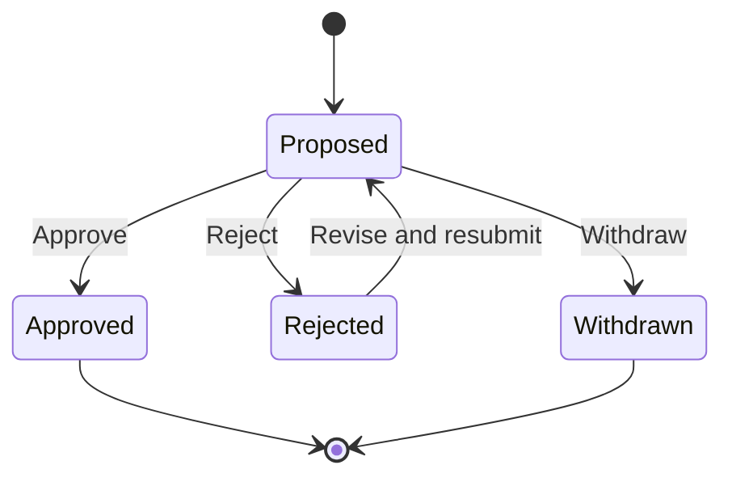

# Decision State Machine

## Purpose

This document defines the lifecycle of a Decision within AIOS.

A Decision represents a formal proposal that requires a human judgment during the lifecycle of a Work.

The state machine ensures that Decisions are reviewed consistently, remain traceable to their related Work, and cannot be resolved autonomously by AI.

---

# Lifecycle

---

# States

## Proposed

A Decision has been submitted for human review.

### Allowed Actions

- View the proposal
- Edit the proposal before review begins
- Add supporting context
- Assign or change the approver
- Approve the Decision
- Reject the Decision
- Withdraw the Decision

---

## Approved

An authorized Member has approved the Decision.

The approved Decision becomes part of the related Work history.

### Allowed Actions

- View the Decision
- View the approval record
- View supporting context

Approved Decisions are immutable.

---

## Rejected

An authorized Member has rejected the Decision.

The rejection must include a reason.

### Allowed Actions

- View the Decision
- View the rejection reason
- Revise the proposal
- Resubmit the Decision

A rejected Decision does not satisfy a pending approval requirement until it has been revised and approved.

---

## Withdrawn

The Decision creator has withdrawn the proposal before approval.

### Allowed Actions

- View the Decision
- View the withdrawal record

Withdrawn Decisions are retained for historical traceability and cannot be resubmitted.

A new Decision must be created when a withdrawn proposal needs to be reconsidered.

---

# Allowed Transitions

| From | To | Condition |
|------|----|-----------|
| Proposed | Approved | Approved by an authorized Member |
| Proposed | Rejected | Rejected by an authorized Member with a reason |
| Proposed | Withdrawn | Withdrawn by the creator before resolution |
| Rejected | Proposed | Proposal revised and resubmitted |

No other transitions are permitted.

---

# Invariants

The following rules must always be true.

## General

- Every Decision belongs to exactly one Organization.
- Every Decision is related to exactly one Work.
- The Decision and its related Work must belong to the same Organization.
- Every Decision has exactly one creator.
- The creator must be an active Member when the Decision is created.
- AI may assist with drafting but cannot create a binding approval or rejection.
- Every state transition must be recorded with the actor and timestamp.

---

## Proposed

- A Proposed Decision must include a title and proposal.
- A Proposed Decision must have at least one authorized approver.
- A Decision can have only one active review cycle at a time.
- A Decision cannot be approved, rejected, and withdrawn simultaneously.
- The proposal may be edited only until an approver has acted on it.

---

## Approved

- Approval must be performed by an active and authorized Member.
- The approval timestamp is immutable.
- The approved content is immutable.
- An Approved Decision cannot return to Proposed or Rejected.
- An Approved Decision satisfies its associated approval requirement.

---

## Rejected

- Rejection must be performed by an active and authorized Member.
- A rejection reason is required.
- Rejection does not complete the related Work.
- Revising and resubmitting creates a new review cycle while preserving previous review history.

---

## Withdrawn

- Only the Decision creator or an authorized Organization administrator may withdraw a Proposed Decision.
- An Approved or Rejected Decision cannot be withdrawn.
- The withdrawal timestamp and actor are immutable.
- A Withdrawn Decision cannot return to another state.

---

# Creator and Approver Rule

For the MVP, the Decision creator may also be the approver.

This behavior is allowed to support small teams and single-owner organizations.

The approval record must still identify the approving Member explicitly.

Separation of duties and mandatory independent approval are outside the MVP scope and may be introduced through future governance policies.

---

# Relationship to Work

A Work does not always require a Decision.

When a Decision is required:

- The Work transitions to `Waiting for Decision`.
- The active Decision remains related to that Work.
- Approval allows the Work to proceed according to its completion rules.
- Rejection returns the Work to `In Progress`.
- Withdrawal returns the Work to `In Progress`.

A Work may contain multiple historical Decisions, but only one unresolved Decision may block the Work at a time in the MVP.

---

# Completion Rules

- A Work requiring approval cannot be completed while its blocking Decision is Proposed.
- An Approved Decision permits completion but does not automatically complete the Work.
- A Rejected or Withdrawn Decision does not permit completion when approval is still required.
- Work completion remains an explicit human action.
- A Work without an approval requirement may be completed without creating a Decision.

---

# Domain Events

The following domain events may be emitted.

- DecisionProposed
- DecisionApproved
- DecisionRejected
- DecisionRevised
- DecisionResubmitted
- DecisionWithdrawn

---

# AI Behavior

The Secretary may assist throughout the Decision process.

| State | Secretary Behavior |
|--------|--------------------|
| Proposed | Draft, summarize, compare options, and identify risks |
| Approved | Summarize the approved rationale for Work history |
| Rejected | Summarize feedback and assist revision |
| Withdrawn | No further action unless a new Decision is created |

The Secretary must not:

- Approve a Decision
- Reject a Decision
- Withdraw a Decision
- Impersonate a human approver
- Change the Decision state autonomously

AI-generated proposals and recommendations must be presented as unapproved content until a human Member acts on them.

---

# Audit Requirements

Each Decision record must preserve:

- Organization
- Related Work
- Creator
- Approver
- Proposal content
- Supporting context
- Current state
- State transition history
- Approval or rejection reason
- Created timestamp
- Resolved timestamp, when applicable

Historical review cycles must remain traceable after revision and resubmission.

---

# Related Documents

- docs/product/mvp.md
- docs/product/use-cases/mvp.md
- docs/architecture/state-machines/work.md
- docs/architecture/state-machines/memory.md