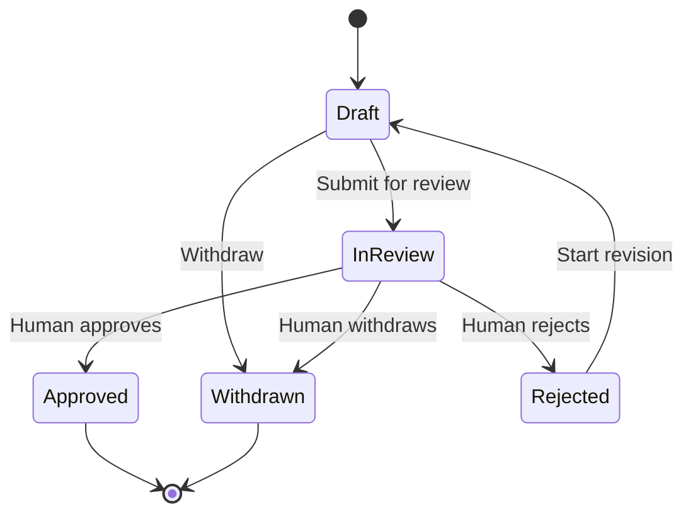

# Decision State Machine
> **Document status:** Proposed  
> **Blueprint version:** 0.2.1  
> **Applies to:** Decision Aggregate
## Purpose
This document defines the lifecycle of `Decision` within AIOS.
A Decision represents an explicit organizational choice made in the context of one Work.
The state machine establishes valid states and transitions, review and revision rules, actor authority, the relationship to Work, and the local invariants protected by the Decision Aggregate.
The central rules are:
> A Decision is resolved only through an explicit action by an authorized Human Member.
> Resolving a Decision never changes the related Work state inside the Decision transaction.
An Approved Decision may satisfy a Work completion gate, but it does not complete the Work.
---
# Scope
This document defines the business lifecycle of one Decision Aggregate.
It does not define the Work or Memory lifecycle, Organization membership, Organization-wide authorization policy, multi-step governance workflows, multiple simultaneous approvers, Knowledge promotion, or execution of the selected option.
For the MVP, every Decision belongs to exactly one Work and exactly one Organization.
---
# State Summary
| State | Meaning | Editable | Resolved | Terminal |
|---|---|---:|---:|---:|
| `Draft` | The proposal is being prepared | Yes | No | No |
| `InReview` | The proposal is locked and awaiting human judgment | No | No | No |
| `Approved` | A human selected and approved an option | No | Yes | Yes |
| `Rejected` | A human rejected the submitted revision | No | Yes | No |
| `Withdrawn` | The proposal was explicitly withdrawn | No | Yes | Yes |
A Rejected Decision may begin a new revision.
Approved and Withdrawn Decisions cannot return to another state in the MVP.
---
# Lifecycle

A transition from `Rejected` to `Draft` starts a new revision of the same organizational question.
It does not erase or rewrite the rejected revision.
---
# State Definitions
## Draft
`Draft` means the Decision is being prepared and has not been submitted for authoritative review.
### Allowed Actions
An authorized Human Member may edit the title, question, context, and options; accept or reject Secretary suggestions; set blocking status; submit for review; or withdraw the Decision.
The Secretary may draft the question, summarize context, suggest and compare options, identify risks, retrieve permitted supporting information, and draft a proposed rationale.
The Secretary cannot submit or withdraw the Decision autonomously.
### State Rules
- The current revision is editable and has no current review outcome, selected authoritative option, or resolution timestamp.
- Blocking status may be changed only in this state.
- Draft content is not authoritative and does not block the related Work.
---
## InReview
`InReview` means the current revision has been submitted and is awaiting human judgment.
The submitted revision is locked so the reviewer evaluates a stable proposal.
### Allowed Actions
An authorized Human Member may:
- view the submitted proposal;
- view options and context;
- view Secretary contributions;
- approve the Decision;
- reject the Decision; or
- withdraw the Decision when authorized.
The Secretary may:
- summarize the submitted proposal;
- compare submitted options;
- identify risks;
- answer questions from permitted source material; and
- prepare a non-authoritative rationale.
### Prohibited Actions
While `InReview`, the system must not:
- edit the submitted question;
- add, update, or remove options;
- change blocking status;
- replace the submitted revision silently;
- allow AI to resolve the Decision; or
- allow more than one authoritative outcome.
### State Rules
- A submitted revision snapshot exists.
- The current proposal content is locked.
- The Decision is unresolved.
- If the Decision is blocking, the related Work may enter `WaitingForDecision` through separate coordination.
- Only a Human Member may produce the authoritative outcome.
---
## Approved
`Approved` means an authorized Human Member selected an option and approved the submitted revision.
### Required Record
An Approved Decision contains:
- the submitted revision;
- the selected option;
- approval rationale;
- approving Human Member;
- approval timestamp; and
- append-only review history.
### Allowed Actions
Users may:
- view the Decision;
- view the selected option;
- view the approval rationale;
- view supporting context;
- view Secretary contributions; and
- view the review history.
### State Rules
- Approved content is immutable.
- The selected option belongs to the approved revision.
- The approval record is immutable.
- The Decision cannot be rejected, withdrawn, or revised.
- Approval emits an authoritative resolution event.
- Approval does not complete the related Work.
---
## Rejected
`Rejected` means an authorized Human Member rejected the submitted revision.
### Required Record
A Rejected Decision contains:
- the rejected revision;
- rejection reason;
- rejecting Human Member;
- rejection timestamp; and
- append-only review history.
### Allowed Actions
An authorized Human Member may:
- view the rejected revision;
- view the rejection reason;
- start a new revision; or
- leave the Decision rejected.
The Secretary may:
- summarize the feedback;
- suggest changes;
- identify missing context; and
- prepare revised draft content.
### State Rules
- The rejected revision is immutable.
- The rejection record is immutable.
- No selected option exists for the rejected revision.
- Rejection resolves the current review cycle.
- Rejection does not complete or cancel the related Work.
- Editing begins only after an explicit `Start Revision` transition.
---
## Withdrawn
`Withdrawn` means an authorized Human Member explicitly ended consideration of the Decision without approval or rejection.
### Required Record
A Withdrawn Decision contains:
- withdrawal reason;
- withdrawing Human Member;
- withdrawal timestamp; and
- the latest preserved draft or submitted revision.
### Allowed Actions
Users may:
- view the Decision;
- view the withdrawal reason;
- view its revision and review history; and
- create a new Decision if the issue must be reconsidered.
### State Rules
- Withdrawn content is immutable.
- The withdrawal record is immutable.
- No option is selected.
- A Withdrawn Decision cannot be resumed or revised in the MVP.
- Withdrawal does not complete or cancel the related Work automatically.
---
# Commands and Transitions
## Create Decision
### Transition
```text
[*] → Draft
```
### Preconditions
- The related Organization exists.
- The related Work exists.
- The Work and Decision use the same Organization.
- The acting Human Member is active and authorized.
- The related Work is not terminal.
- Required initial fields are valid.
### Effects
- Create the Decision in `Draft`.
- Set revision number to `1`.
- Record Organization, Work, proposer, and creation timestamp.
- Record whether the Decision is initially blocking or non-blocking.
- Emit `DecisionDraftCreated`.
Organization, Work, and proposer relationships are immutable after creation.
---
## Update Draft
### Transition
```text
Draft → Draft
```
### Preconditions
- The actor is an authorized Human Member.
- The Decision is `Draft`.
- The command uses the expected Aggregate version.
- Updated values satisfy local validation.
### Effects
The command may:
- update title, question, or context;
- add, update, or remove options;
- change blocking status;
- accept Secretary-suggested content; and
- record the modification in audit history.
Relevant change events may be emitted.
A material change to the organizational question requires a new Decision rather than a revision of the existing Decision.
---
## Submit for Review
### Transition
```text
Draft → InReview
```
### Preconditions
- The actor is an authorized Human Member.
- The title and organizational question are valid.
- The proposal contains sufficient review context.
- At least one valid option exists.
- No duplicate option identity exists.
- No current review cycle is active.
- The related Work is not terminal.
- If blocking, no other unresolved blocking Decision exists for the Work.
- The command uses the expected Aggregate version.
### Effects
- Capture an immutable submitted revision snapshot.
- Lock current proposal content.
- Record submitter and submission timestamp.
- Open one review cycle.
- Emit `DecisionSubmittedForReview`.
For a blocking Decision, the event may cause the Work module to request:
```text
InProgress → WaitingForDecision
```
The Decision Aggregate does not change Work state directly.
---
## Approve Decision
### Transition
```text
InReview → Approved
```
### Preconditions
- The actor is an authorized Human Member.
- The Decision is `InReview`.
- The selected option belongs to the submitted revision.
- An approval rationale is provided.
- The command uses the expected Aggregate version.
- No authoritative outcome already exists.
### Effects
- Record the selected option.
- Record the approval rationale.
- Record the approving Human Member.
- Record the approval timestamp.
- Append an approval review record.
- Set state to `Approved`.
- Emit `DecisionApproved`.
For the MVP, the proposer may also be the approver unless Organization policy prohibits self-approval.
Self-approval must remain explicit and fully audited.
---
## Reject Decision
### Transition
```text
InReview → Rejected
```
### Preconditions
- The actor is an authorized Human Member.
- The Decision is `InReview`.
- A rejection reason is provided.
- The command uses the expected Aggregate version.
- No authoritative outcome already exists.
### Effects
- Record the rejection reason.
- Record the rejecting Human Member.
- Record the rejection timestamp.
- Append a rejection review record.
- Set state to `Rejected`.
- Emit `DecisionRejected`.
Rejection creates no selected option.
---
## Start Revision
### Transition
```text
Rejected → Draft
```
### Preconditions
- The actor is an authorized Human Member.
- The Decision is `Rejected`.
- A revision explanation is provided.
- The organizational question remains materially the same.
- The related Work is not terminal.
- The command uses the expected Aggregate version.
### Effects
- Increment the revision number.
- Preserve the rejected revision and its review record.
- Create a new editable draft based on the prior proposal.
- Clear only the current revision's unresolved outcome fields.
- Record the revision explanation and actor.
- Set state to `Draft`.
- Emit `DecisionRevisionStarted`.
Revision does not erase rejection history.
The revised Decision must be submitted again before it can be approved or rejected.
---
## Withdraw Decision
### Transitions
```text
Draft → Withdrawn
InReview → Withdrawn
```
### Preconditions
- The actor is an authorized Human Member.
- The actor is the proposer or has Organization-level withdrawal permission.
- A withdrawal reason is provided.
- The Decision is not already resolved as Approved or Rejected.
- The command uses the expected Aggregate version.
### Effects
- Preserve the latest draft or submitted revision.
- Record the withdrawal reason.
- Record the withdrawing Human Member.
- Record the withdrawal timestamp.
- Append a withdrawal record.
- Set state to `Withdrawn`.
- Emit `DecisionWithdrawn`.
If an InReview Decision is blocking, the resolution event allows the Work module to record an unsatisfied outcome.
---
# Allowed Transition Table
| From | Command | To | Primary Guard |
|---|---|---|---|
| `[*]` | Create Decision | `Draft` | Authorized human and active Work |
| `Draft` | Update Draft | `Draft` | Editable current revision |
| `Draft` | Submit for Review | `InReview` | Valid stable proposal |
| `Draft` | Withdraw Decision | `Withdrawn` | Authorized human and reason |
| `InReview` | Approve Decision | `Approved` | Valid option, rationale, human authority |
| `InReview` | Reject Decision | `Rejected` | Human authority and reason |
| `InReview` | Withdraw Decision | `Withdrawn` | Authorized human and reason |
| `Rejected` | Start Revision | `Draft` | Same question and revision explanation |
No other lifecycle transitions are permitted in the MVP.
---
# Revision and Review Model
A Decision represents one organizational question across one or more revisions.
The revision number:
- starts at `1`;
- increases only when a Rejected Decision starts a new revision;
- never decreases; and
- remains associated with its submitted snapshot and review records.
Each submitted revision has at most one authoritative review outcome.
The conceptual history is:
```text
Decision
  ├── Revision 1
  │     ├── Submitted Snapshot
  │     └── Rejected Review Record
  └── Revision 2
        ├── Submitted Snapshot
        └── Approved Review Record
```
The implementation must preserve:
- every submitted revision snapshot;
- every review outcome;
- every reviewer;
- every rationale or reason;
- every relevant timestamp; and
- every accepted Secretary contribution attribution.
Previous revisions must never be overwritten.
A revision may improve context and options, but it must continue to address the same organizational question.
If the question changes materially, a new Decision must be created.
---
# Blocking Decisions
Blocking status indicates whether an unresolved submitted Decision prevents Work completion.
For the MVP:
- blocking status is selected in `Draft`;
- blocking status is locked when submitted;
- only an `InReview` blocking Decision actively blocks Work;
- only one unresolved blocking Decision may exist per Work;
- non-blocking Decisions do not change Work state;
- Approved, Rejected, and Withdrawn Decisions are resolved; and
- resolving a blocking Decision does not complete or cancel Work.
The rule “only one unresolved blocking Decision per Work” is a cross-Aggregate rule.
It must be enforced through the Application Layer, repository queries, transaction coordination, or a database constraint where appropriate.
It is not a local invariant that one Decision Aggregate can prove by itself.
---
# Relationship to Work
The Decision Aggregate owns:
- Decision question;
- proposal revisions;
- options;
- blocking designation;
- review lifecycle;
- selected option;
- rationale;
- review history; and
- Decision Domain Events.
The Work Aggregate owns:
- Work lifecycle;
- the local completion-gate snapshot;
- `WaitingForDecision`;
- explicit Work completion; and
- explicit Work cancellation.
The Decision Aggregate must never directly:
- change Work state;
- mark Work complete;
- cancel Work;
- satisfy the Work completion gate; or
- reopen Work.
## Blocking Submission Flow
```text
Decision: Draft
        ↓ Human submits blocking Decision
Decision: InReview
        ↓ DecisionSubmittedForReview
Work coordination records blocking Decision
        ↓
Work: WaitingForDecision
```
## Approval Flow
```text
Decision: InReview
        ↓ Human approves
Decision: Approved
        ↓ DecisionApproved
Work records Approved outcome
        ↓
Work: InProgress
Completion gate: Satisfied
        ↓ Separate human command
Work: Completed
```
## Rejection Flow
```text
Decision: InReview
        ↓ Human rejects
Decision: Rejected
        ↓ DecisionRejected
Work records Rejected outcome
        ↓
Work: InProgress
Completion gate: Unsatisfied
```
## Withdrawal Flow
```text
Decision: InReview
        ↓ Human withdraws
Decision: Withdrawn
        ↓ DecisionWithdrawn
Work records Withdrawn outcome
        ↓
Work: InProgress
Completion gate: Unsatisfied
```
Decision resolution and Work coordination may be eventually consistent.
The Work update must be performed through reliable, idempotent processing.
---
# Aggregate Invariants
The Decision Aggregate must always enforce the following local invariants.
## Identity and Ownership
- Every Decision has exactly one Decision identifier.
- Every Decision belongs to exactly one Organization.
- Every Decision belongs to exactly one Work.
- Organization and Work references cannot change.
- Every Decision has exactly one proposer.
- The proposer reference cannot change.
## State
- The Decision is in exactly one lifecycle state.
- Only transitions listed in this document are valid.
- Approved and Withdrawn Decisions are terminal.
- Rejected may return only to Draft through `Start Revision`.
- Only one current review cycle may exist.
- Only one authoritative outcome may exist per submitted revision.
## Draft Integrity
- Only Draft content is editable.
- No authoritative selected option exists in Draft.
- No current resolution record exists in Draft.
- Blocking status may change only in Draft.
- Draft edits cannot rewrite prior submitted revisions.
## Review Integrity
- InReview requires an immutable submitted revision snapshot.
- Submitted content is locked.
- An InReview Decision has no authoritative outcome.
- Only a Human Member may resolve the review.
- AI output cannot become an outcome without human action.
## Approval Integrity
An Approved Decision always contains:
- a submitted revision;
- at least one option;
- a selected option from that revision;
- an approving Human Member;
- an approval rationale; and
- an approval timestamp.
Approved content and approval records are immutable.
## Rejection Integrity
A Rejected Decision always contains:
- a submitted revision;
- a rejecting Human Member;
- a rejection reason;
- a rejection timestamp; and
- no selected option for that revision.
The rejected revision and rejection record are immutable.
## Withdrawal Integrity
A Withdrawn Decision always contains:
- a withdrawing Human Member;
- a withdrawal reason;
- a withdrawal timestamp; and
- no selected option.
A Withdrawn Decision cannot be revised.
## Revision Integrity
- Revision begins at `1`.
- Revision increases only through `Start Revision`.
- Revision never decreases.
- Every revision addresses the same organizational question.
- Previous submitted snapshots and outcomes are append-only.
- A revision cannot delete or alter prior review history.
## Historical Integrity
- Review records are append-only.
- Secretary contribution records are append-only.
- Actor identity and timestamps are immutable.
- Accepted AI-assisted content remains attributable.
- Historical records remain available after Work completion or cancellation.
---
# Cross-Aggregate Preconditions
The following rules are required but are not enforced by the Decision Aggregate alone:
- the Organization exists;
- the related Work exists;
- the Work and Decision belong to the same Organization;
- the Work is not terminal when a Decision is created, submitted, or revised;
- the acting Human Member is active in the Organization;
- the acting Human Member has the required permission;
- no other unresolved blocking Decision exists for the Work;
- Organization policy permits self-approval where applicable; and
- the related Work receives resolution events.
These rules are enforced through:
- Application Services;
- authorization policies;
- repositories;
- database constraints;
- Transactional Outbox processing; and
- idempotent event handlers.
They must not be mislabeled as local Decision Aggregate invariants.
---
# Domain Events
The Decision Aggregate may emit:
- `DecisionDraftCreated`
- `DecisionDetailsUpdated`
- `DecisionOptionAdded`
- `DecisionOptionUpdated`
- `DecisionOptionRemoved`
- `DecisionBlockingStatusChanged`
- `DecisionSecretaryContributionRecorded`
- `DecisionSubmittedForReview`
- `DecisionApproved`
- `DecisionRejected`
- `DecisionRevisionStarted`
- `DecisionWithdrawn`
Every event must include:
- event identifier;
- event type;
- Decision identifier;
- Work identifier;
- Organization identifier;
- revision number;
- Aggregate version;
- occurred-at timestamp;
- acting principal; and
- transition-specific data.
Resolution events must include:
- outcome;
- blocking status;
- originating Human Member;
- resolution timestamp;
- selected option and rationale when Approved; or
- reason when Rejected or Withdrawn.
Events that trigger required cross-Aggregate work must be persisted durably through a Transactional Outbox or equivalent mechanism.
---
# Authority Model
## Human Member
Only an authorized Human Member may:
- submit a Decision for review;
- approve;
- reject;
- withdraw; or
- start a revision.
For the MVP, the proposer may approve their own Decision unless Organization policy prohibits it.
## Secretary
The Secretary is an AI Principal.
It may:
- draft;
- summarize;
- suggest options;
- compare alternatives;
- identify risks;
- retrieve permitted context; and
- draft non-authoritative rationale.
It may not:
- submit a Decision autonomously;
- approve;
- reject;
- withdraw;
- select the final option;
- change blocking status autonomously;
- impersonate a human reviewer; or
- change Decision state.
## System Principal
A System Principal may:
- dispatch Domain Events;
- update projections;
- notify participants;
- coordinate the related Work from authoritative events; and
- retry failed technical processing.
A System Principal does not make the underlying organizational judgment.
Audit must distinguish:
- the Human Member who resolved the Decision; and
- the System Principal that processed downstream effects.
---
# Concurrency and Idempotency
The implementation must use optimistic concurrency or an equivalent mechanism.
Each state-changing command must validate an expected Aggregate version.
Concurrent resolution attempts may include:
- two Members approving different options;
- one Member approving while another rejects;
- withdrawal during approval;
- draft modification during submission; and
- revision start while another process acts on the rejected Decision.
Only one valid transition may commit.
A stale command must fail and reload the latest Decision state.
Idempotency rules include:
- retrying the same approval command must not create duplicate review records;
- reprocessing `DecisionApproved` must not satisfy the Work gate twice;
- duplicate Secretary contribution events must not create duplicate records;
- repeated submission with the same command identifier must not open multiple review cycles; and
- one revision cannot receive multiple authoritative outcomes.
Infrastructure may use:
- `CommandId`;
- `EventId`;
- `IdempotencyKey`; and
- Aggregate version.
---
# Failure Semantics
## Resolution Transaction Failure
If approval, rejection, or withdrawal fails before the Decision transaction commits:
- the Decision remains `InReview`;
- no resolution event is committed; and
- the related Work remains unchanged.
## Downstream Work Coordination Failure
If the Decision resolves successfully but the Work update fails:
- the Decision remains resolved;
- the Work may temporarily remain `WaitingForDecision`;
- the resolution event is retried;
- duplicate application is prevented; and
- the failure is visible operationally.
The system must not reverse the Decision merely because downstream processing failed.
## Blocking Submission Coordination Failure
If a blocking Decision is submitted but the Work cannot enter `WaitingForDecision`:
- the Decision remains `InReview`;
- the coordination event is retried or recovered;
- the inconsistency is visible; and
- Work completion protection must use reliable coordination and appropriate application safeguards.
## Secretary Failure
If Secretary assistance fails:
- Decision state does not change;
- human-authored content remains available;
- the failure may be retried; and
- human review authority is unaffected.
---
# Audit Requirements
Every Decision must preserve:
- Decision identifier;
- Organization identifier;
- Work identifier;
- proposer;
- title and organizational question;
- blocking status;
- all revision numbers;
- all draft-to-submitted snapshots;
- all options per revision;
- all accepted Secretary contributions;
- current state;
- Aggregate version;
- submission actor and timestamp;
- review outcome;
- selected option where applicable;
- rationale or reason;
- reviewer or withdrawer;
- resolution timestamp; and
- complete transition history.
Audit records must distinguish human, AI, and system actions.
Historical review cycles must not be silently overwritten.
---
# Related Documents
- `docs/architecture/overview.md`
- `docs/product/mvp.md`
- `docs/product/roadmap.md`
- `docs/product/use-cases/mvp.md`
- `docs/architecture/state-machines/work.md`
- `docs/architecture/state-machines/memory.md`
- `docs/architecture/aggregates/decision.md`
- `docs/architecture/aggregates/work.md`
- `docs/architecture/authorization.md`
