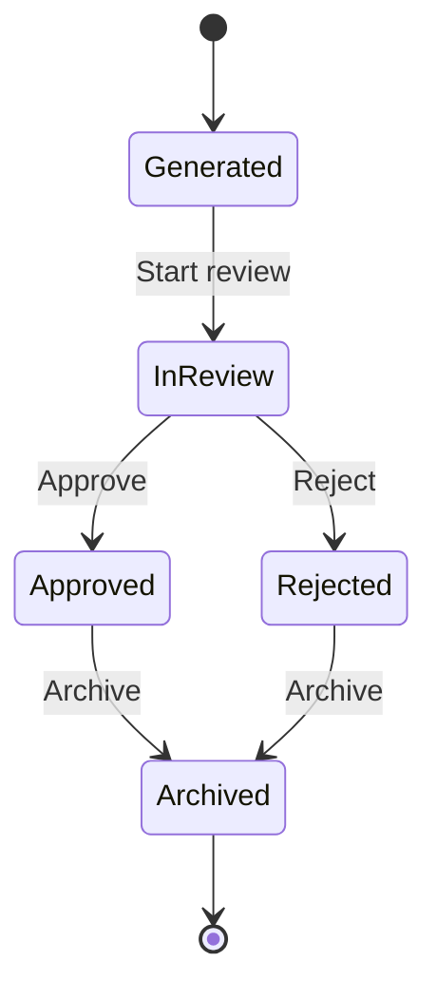

# Memory State Machine

## Purpose

This document defines the lifecycle of a Memory within AIOS.

A Memory represents organizational experience automatically generated from completed Work.

A Memory is a historical record of what happened during a specific Work.

It is **not** reusable organizational knowledge.

Knowledge is created separately through the promotion of an approved Memory.

---

# Lifecycle



---

# States

## Generated

A Memory has been automatically generated from a completed Work.

Generated Memories are considered unreviewed historical records.

### Allowed Actions

- View
- Start review

Editing is not permitted.

---

## In Review

A Member is reviewing the generated Memory.

### Allowed Actions

- Approve
- Reject

Reviewers may attach comments to support their decision.

---

## Approved

The Memory has been verified as an accurate representation of the completed Work.

Approved Memories remain immutable historical records.

Approval does **not** automatically create Knowledge.

Knowledge promotion is a separate business process.

### Allowed Actions

- View
- Request Knowledge promotion
- Archive

---

## Rejected

The Memory has been determined to be inaccurate, incomplete, or unsuitable.

Rejected Memories remain part of the organization's audit history.

### Allowed Actions

- View
- Archive

Rejected Memories cannot be promoted to Knowledge.

---

## Archived

The Memory is retained only for historical and audit purposes.

Archived Memories are read-only.

---

# Allowed Transitions

| From | To | Condition |
|------|----|-----------|
| Generated | In Review | Review started |
| In Review | Approved | Approved by reviewer |
| In Review | Rejected | Rejected by reviewer |
| Approved | Archived | Archived |
| Rejected | Archived | Archived |

No other transitions are permitted.

---

# Invariants

The following rules must always be true.

## General

- Every Memory belongs to exactly one Organization.
- Every Memory originates from exactly one completed Work.
- Every Memory references its source Work.
- Every Memory records all related Decisions.
- Every Memory preserves AI contributions.
- Every state transition is recorded.

---

## Generated

- Created automatically when a Work is completed.
- Exactly one Memory is generated for each completed Work.
- Members cannot create Memories manually.
- AI generates the initial Memory.

---

## In Review

- Review must be performed by an active Member.
- AI cannot approve or reject a Memory.
- Review comments are permanently preserved.

---

## Approved

- Approval confirms historical accuracy.
- Approved content becomes immutable.
- Approval timestamp is immutable.
- An Approved Memory may become the source of future Knowledge.

---

## Rejected

- Rejection requires a reason.
- Rejected Memories remain searchable for audit purposes.
- Rejected Memories can never become Knowledge.

---

## Archived

- Archived Memories remain immutable.
- Archived Memories remain available for historical investigation.
- Archived Memories are excluded from active review processes.

---

# Relationship to Work

A Memory always originates from one completed Work.

A Memory references:

- Organization
- Work
- Decisions
- Participants
- Timeline
- AI Contributions

A Memory cannot exist without its source Work.

---

# Relationship to Knowledge

Knowledge is **not** a Memory state.

Knowledge is an independent business object created from an Approved Memory.

Promotion follows this business process:

```text
Completed Work
        ↓
Generated Memory
        ↓
Human Review
        ↓
Approved Memory
        ↓
Knowledge Promotion
        ↓
Knowledge Created
```

The original Memory always remains unchanged.

Knowledge maintains a permanent reference back to its source Memory.

---

# Domain Events

The following domain events may be emitted.

- MemoryGenerated
- MemoryReviewStarted
- MemoryApproved
- MemoryRejected
- MemoryArchived
- KnowledgePromotionRequested

Knowledge creation is handled separately by the Knowledge domain.

---

# AI Behavior

The Secretary is responsible only for generating the initial Memory.

The Secretary may:

- Summarize the completed Work
- Summarize Decisions
- Extract lessons learned
- Organize timelines
- Identify important outcomes

The Secretary must never:

- Approve a Memory
- Reject a Memory
- Promote Knowledge
- Modify an approved Memory
- Modify historical records

All review and promotion actions require a human Member.

---

# Audit Requirements

Every Memory preserves:

- Organization
- Source Work
- Related Decisions
- Participants
- AI-generated summary
- Lessons learned
- AI model version
- Prompt version
- Current state
- Review history
- Creation timestamp
- Review timestamp
- Archive timestamp (if applicable)

Audit information is immutable.

---

# Related Documents

- docs/product/mvp.md
- docs/product/use-cases/mvp.md
- docs/architecture/state-machines/work.md
- docs/architecture/state-machines/decision.md
- docs/architecture/state-machines/knowledge.md