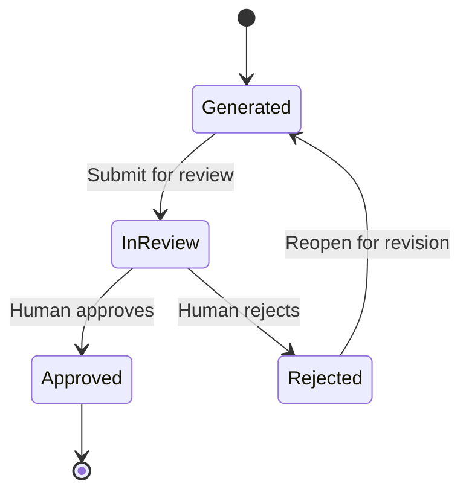

# Memory State Machine
> **Document status:** Proposed · **Blueprint version:** 0.2.1 · **Applies to:** Memory Aggregate
## Purpose
This document defines the lifecycle of `Memory` within AIOS.
A Memory is an Organization-owned record generated from one completed Work and reviewed by humans before it becomes authoritative organizational history.
The state machine establishes:
- the valid Memory states;
- when Memory content may be edited;
- how human review is performed;
- when immutability begins;
- how rejection and resubmission work;
- the authority boundaries for Human Members, AI Principals, and System Principals;
- the relationship between Memory, Work, Decision, and future Knowledge; and
- the local invariants protected by the Memory Aggregate.
The central rules are:
> Generated Memory is an editable AI-assisted draft, not authoritative organizational history.
> Approved Memory is immutable organizational history.
> Memory approval does not create Knowledge.
---
# Scope
This document defines the business lifecycle of one Memory Aggregate after a Memory draft has been generated successfully.
It does not define:
- the Work lifecycle;
- the Decision lifecycle;
- AI-provider request execution;
- generation-job scheduling;
- Knowledge promotion;
- Knowledge lifecycle;
- post-approval MemoryRevision;
- archival and retention policy; or
- enterprise multi-reviewer governance.
Memory generation is triggered asynchronously after Work completion.
A failed generation attempt does not create a Memory lifecycle state. Generation attempts and retries are operational process state outside the Memory Aggregate until a valid draft is created.
Archival is an orthogonal visibility or retention concern in the MVP, not a Memory lifecycle state.
---
# State Summary
| State | Meaning | Content editable | Reviewable | Authoritative | Terminal |
|---|---|---:|---:|---:|---:|
| `Generated` | AI-generated or reopened draft | Yes | Not yet submitted | No | No |
| `InReview` | Stable draft submitted for human review | No | Yes | No | No |
| `Rejected` | Submitted draft was rejected | No | No | No | No |
| `Approved` | Human-approved organizational history | No | Completed | Yes | Yes |
Approved Memory cannot return to another state in the MVP.
Rejected Memory may be reopened as the same Memory Aggregate.
---
# Lifecycle

Draft correction before approval does not create a separate `MemoryRevision` object.
The Aggregate preserves edit and review history while retaining one Memory identity.
---
# State Definitions
## Generated
`Generated` means the Memory exists as an editable draft.
The state is used both:
- immediately after successful AI generation; and
- after a Rejected Memory is explicitly reopened for revision.
A Generated Memory is not authoritative organizational history.
### Allowed Actions
An authorized Human Member may:
- view the generated draft;
- compare the draft with its source references;
- edit the title;
- correct the summary;
- correct the outcome description;
- add or remove draft lessons;
- add missing context;
- remove unsupported statements;
- update relevant Decision references through a validated use case;
- add an edit explanation;
- submit the Memory for review; or
- leave it as a draft.
The Secretary may:
- generate the initial draft;
- suggest corrections;
- regenerate selected draft sections;
- summarize source material;
- identify missing context;
- organize the timeline; and
- propose lessons observed.
Secretary changes must remain attributable and reviewable.
### State Rules
- Content is editable.
- No active review cycle exists.
- No approval record exists.
- No authoritative historical claim is implied.
- Source Work identity cannot change.
- Organization ownership cannot change.
- Human and Secretary edits are auditable.
- The Memory cannot be promoted to Knowledge.
---
## InReview
`InReview` means an authorized Human Member submitted a stable Memory draft for review.
The submitted content is locked so the reviewer evaluates one specific snapshot.
### Allowed Actions
An authorized Human Member may:
- view the submitted snapshot;
- inspect the completed Work snapshot;
- inspect related Decision references;
- inspect edit and generation provenance;
- add a review comment;
- approve the Memory; or
- reject the Memory.
The Secretary may:
- explain how the draft was generated;
- summarize source references; and
- answer questions using permitted source material.
### Prohibited Actions
While InReview, the system must not:
- edit Memory content;
- replace the submitted snapshot;
- change source Work;
- add or remove Decision references silently;
- allow AI to approve or reject;
- create Knowledge from the unapproved Memory; or
- allow more than one authoritative outcome for the review cycle.
### State Rules
- An immutable submitted snapshot exists.
- Exactly one review cycle is active.
- The Memory is not yet authoritative.
- Only an authorized Human Member may resolve the review.
- Review comments are append-only.
---
## Rejected
`Rejected` means an authorized Human Member determined that the submitted Memory was inaccurate, incomplete, unsupported, or otherwise unsuitable for approval.
Rejected Memory is retained for audit and correction.
It is not approved organizational history and cannot be used as Published Knowledge.
### Required Record
A Rejected Memory contains:
- the rejected submitted snapshot;
- the rejecting Human Member;
- a rejection reason;
- the rejection timestamp; and
- append-only review history.
### Allowed Actions
An authorized Human Member may:
- view the rejected snapshot;
- view the rejection reason;
- view source references;
- reopen the Memory for revision; or
- leave it rejected.
The Secretary may:
- summarize reviewer feedback;
- identify likely corrections; and
- prepare non-authoritative revision suggestions.
### State Rules
- The rejected snapshot is immutable.
- The rejection record is immutable.
- No active review cycle exists.
- The Memory remains non-authoritative.
- Editing begins only after an explicit `Reopen for Revision` transition.
- Rejection does not create another Memory.
---
## Approved
`Approved` means an authorized Human Member confirmed that the submitted Memory is an acceptable historical representation of the completed Work.
Approval means:
> This submitted Memory is accepted as organizational history for the source Work.
Approval does not mean:
> Every lesson is universally valid or reusable organizational Knowledge.
### Required Record
An Approved Memory contains:
- the approved submitted snapshot;
- the approving Human Member;
- an approval comment or confirmation;
- the approval timestamp;
- complete generation provenance;
- complete edit history;
- complete review history; and
- permanent source references.
### Allowed Actions
Users may:
- view the Memory;
- inspect its source Work;
- inspect related Decisions;
- inspect generation and edit provenance;
- cite it from future processes; and
- hide or archive it through a separate retention or view mechanism.
### State Rules
- Approved content is immutable.
- Approval identity and timestamp are immutable.
- Source references are immutable.
- The Memory cannot return to Generated, InReview, or Rejected.
- The Memory cannot be corrected in place.
- Future correction requires a separate append-only MemoryRevision process.
- Approval does not automatically request or create Knowledge.
---
# Commands and Transitions
## Create Generated Memory
### Transition
```text
[*] → Generated
```
This is an internal domain creation operation invoked only after successful generation.
It is not a manual end-user `CreateMemory` command.
### Preconditions
- A valid `WorkCompleted` fact exists.
- The source Work is completed.
- The Work belongs to the target Organization.
- No Memory already exists for the source Work.
- Required source references are valid.
- Generated content satisfies minimum structural validation.
- The generation request is idempotent.
### Effects
- Create one Memory in `Generated`.
- Assign one immutable Memory identity.
- Record Organization and source Work.
- Record source snapshot and Decision references.
- Record Secretary identity and generation metadata.
- Record model and prompt or policy versions where available.
- Record generation timestamp.
- Emit `MemoryGenerated`.
The Memory Aggregate does not complete Work and does not modify Decision state.
---
## Edit Generated Memory
### Transition
```text
Generated → Generated
```
### Preconditions
- The actor is an authorized Human Member, or the change is an explicitly requested Secretary suggestion.
- The Memory is Generated.
- The command uses the expected Aggregate version.
- The source Work and Organization remain unchanged.
- Updated content satisfies local validation.
### Effects
- Update editable draft content.
- Append an edit record.
- Attribute the edit to a Human Member or Secretary.
- Preserve the prior content or sufficient change history for audit.
- Emit `MemoryDraftEdited`.
A Secretary suggestion must not be recorded as a human edit.
---
## Submit for Review
### Transition
```text
Generated → InReview
```
### Preconditions
- The actor is an authorized Human Member.
- Required Memory sections are present.
- The draft contains a valid Work outcome description.
- Source references are internally valid.
- Unsupported required placeholders are resolved.
- No active review cycle exists.
- The command uses the expected Aggregate version.
### Effects
- Capture an immutable submitted snapshot.
- Lock Memory content.
- Record submitter and submission timestamp.
- Open one review cycle.
- Emit `MemorySubmittedForReview`.
Submission is not approval.
---
## Approve Memory
### Transition
```text
InReview → Approved
```
### Preconditions
- The actor is an authorized Human Member.
- The Memory is InReview.
- A submitted snapshot exists.
- No review outcome already exists.
- Required provenance is present.
- The command uses the expected Aggregate version.
### Effects
- Record the approving Human Member.
- Record approval timestamp.
- Record the approval comment or confirmation.
- Append an approval review record.
- Set state to Approved.
- Make approved content and source references immutable.
- Emit `MemoryApproved`.
For the MVP, the submitter may also approve the Memory unless Organization policy prohibits self-approval.
AI cannot approve Memory under any policy.
---
## Reject Memory
### Transition
```text
InReview → Rejected
```
### Preconditions
- The actor is an authorized Human Member.
- The Memory is InReview.
- A rejection reason is provided.
- No review outcome already exists.
- The command uses the expected Aggregate version.
### Effects
- Record the rejecting Human Member.
- Record the rejection reason.
- Record the rejection timestamp.
- Append a rejection review record.
- Set state to Rejected.
- Emit `MemoryRejected`.
The rejected submitted snapshot remains unchanged.
---
## Reopen for Revision
### Transition
```text
Rejected → Generated
```
### Preconditions
- The actor is an authorized Human Member.
- The Memory is Rejected.
- A reopen explanation is provided.
- The command uses the expected Aggregate version.
### Effects
- Preserve the rejected snapshot and review record.
- Create a new editable draft from the rejected content.
- Increment the internal draft cycle number.
- Record the reopening actor and explanation.
- Set state to Generated.
- Emit `MemoryReopenedForRevision`.
This operation keeps the same Memory identity.
It does not create a `MemoryRevision` domain object.
---
# Allowed Transition Table
| From | Command | To | Primary Guard |
|---|---|---|---|
| `[*]` | Create Generated Memory | `Generated` | Completed Work and no existing Memory |
| `Generated` | Edit Generated Memory | `Generated` | Authorized, auditable draft edit |
| `Generated` | Submit for Review | `InReview` | Complete stable draft |
| `InReview` | Approve Memory | `Approved` | Authorized Human Member |
| `InReview` | Reject Memory | `Rejected` | Authorized Human Member and reason |
| `Rejected` | Reopen for Revision | `Generated` | Authorized Human Member and explanation |
No other lifecycle transitions are permitted in the MVP.
---
# Draft Cycles and Review History
The MVP keeps one Memory identity while allowing multiple pre-approval draft cycles.
A conceptual history may be:
```text
Memory
  ├── Draft Cycle 1
  │     ├── Generated Content
  │     ├── Human Edits
  │     ├── Submitted Snapshot
  │     └── Rejected Review Record
  └── Draft Cycle 2
        ├── Reopened Draft
        ├── Human and Secretary Edits
        ├── Submitted Snapshot
        └── Approved Review Record
```
`draftCycle`:
- begins at `1`;
- increments only when Rejected Memory is reopened;
- never decreases; and
- is not a separate Aggregate or `MemoryRevision`.
The implementation must preserve:
- initial AI-generated content;
- accepted Human and Secretary edits;
- every submitted snapshot;
- every review outcome;
- every reviewer;
- every reason or approval comment; and
- every relevant timestamp.
Approved content is the final submitted snapshot from the approved review cycle.
---
# Relationship to Work
Every Memory originates from exactly one completed Work.
The source relationship is immutable:
```text
Work 1 ─── 0..1 Memory
```
The Memory Aggregate stores:
- `organizationId`;
- `workId`;
- completion facts required for provenance;
- a stable Work snapshot or stable source references; and
- related Decision references.
The Work Aggregate owns Work completion.
The Memory Aggregate must never:
- complete Work;
- reopen Work;
- cancel Work;
- modify Work content; or
- change the Work completion record.
## Generation Flow
```text
Human explicitly completes Work
        ↓
WorkCompleted stored durably
        ↓
Background generation process
        ↓
Secretary generates structured draft
        ↓
Create Generated Memory
```
Memory creation may be eventually consistent after Work completion.
Generation failure leaves Work Completed and creates no invalid Memory state.
---
# Relationship to Decision
Memory may reference multiple Decisions associated with its source Work.
The Decision Aggregate remains authoritative for:
- Decision content;
- submitted revisions;
- selected option;
- rationale;
- reviewer; and
- resolution history.
Memory may store:
- immutable Decision identifiers;
- stable Decision snapshots;
- summarized Decision outcomes; and
- source-reference metadata.
A Memory must not rewrite or reinterpret Decision state as if it were authoritative.
Decision references included in an approved Memory become part of the immutable approved snapshot.
The rule that referenced Decisions belong to the same Organization is a cross-Aggregate validation rule.
---
# Relationship to Knowledge
Memory and Knowledge are different business objects.
```text
Approved Memory
      ↓
Future promotion process
      ↓
Knowledge
```
For the MVP:
- Knowledge promotion is out of scope;
- no Memory state is named Knowledge;
- approval does not create Knowledge;
- Memory does not publish itself;
- `KnowledgePromotionRequested` is not a Memory lifecycle event; and
- Generated, InReview, and Rejected Memory cannot be treated as organizational Knowledge.
In a future phase, Approved Memory may serve as source Evidence for one or more Knowledge records.
Future Knowledge must preserve permanent references to its source Memory without modifying that Memory.
---
# Aggregate Invariants
The Memory Aggregate must always enforce the following local invariants.
## Identity and Ownership
- Every Memory has exactly one Memory identifier.
- Every Memory belongs to exactly one Organization.
- Every Memory references exactly one source Work.
- Memory identity, Organization, and source Work never change.
- One Memory Aggregate represents one Work only.
## State
- The Memory is in exactly one lifecycle state.
- Only transitions listed in this document are valid.
- Approved is terminal.
- Rejected may return only to Generated through `Reopen for Revision`.
- Exactly one current draft cycle exists.
- At most one active review cycle exists.
- At most one authoritative outcome exists per review cycle.
## Draft Integrity
- Only Generated content is editable.
- Every edit is attributable.
- Draft edits cannot change Organization or source Work.
- Draft edits cannot rewrite prior submitted snapshots.
- Generated content is not authoritative.
## Review Integrity
- InReview requires an immutable submitted snapshot.
- InReview content is locked.
- Only a Human Member may approve or reject.
- AI has no review authority.
- Review records are append-only.
- One review cycle cannot be both Approved and Rejected.
## Rejection Integrity
A Rejected Memory always contains:
- a submitted snapshot;
- a rejecting Human Member;
- a rejection reason;
- a rejection timestamp; and
- no approval record for that cycle.
The rejected snapshot and rejection record are immutable.
## Approval Integrity
An Approved Memory always contains:
- a submitted snapshot;
- an approving Human Member;
- an approval timestamp;
- generation provenance;
- source Work reference;
- review history; and
- an immutable approved content snapshot.
Approved Memory cannot be edited or reopened.
## Historical Integrity
- Initial generation provenance is immutable.
- Submitted snapshots are immutable.
- Review records are append-only.
- Edit records are append-only or reconstructable as an immutable audit chain.
- Actor identities and timestamps are immutable.
- Human, AI, and system actions remain distinguishable.
---
# Cross-Aggregate Preconditions
The following rules are required but cannot be proven by the Memory Aggregate alone:
- the Organization exists;
- the source Work exists and is Completed;
- the Work and Memory belong to the same Organization;
- referenced Decisions exist;
- referenced Decisions belong to the same Organization and Work;
- the acting Human Member is active and authorized;
- no other Memory exists for the source Work; and
- the generation request originates from a valid WorkCompleted event.
These rules are enforced through:
- Application Services;
- authorization policies;
- repositories;
- database constraints;
- unique indexes;
- Transactional Outbox processing; and
- idempotent handlers.
They must not be mislabeled as local Memory Aggregate invariants.
A database-level unique constraint on `workId` should reinforce one Memory per Work.
---
# Domain Events
The Memory Aggregate may emit:
- `MemoryGenerated`
- `MemoryDraftEdited`
- `MemorySubmittedForReview`
- `MemoryApproved`
- `MemoryRejected`
- `MemoryReopenedForRevision`
Every event must include:
- event identifier;
- event type;
- Memory identifier;
- Work identifier;
- Organization identifier;
- draft cycle;
- Aggregate version;
- occurred-at timestamp;
- acting principal; and
- transition-specific data.
`MemoryGenerated` must include generation provenance.
Review events must include the Human Member who performed the action.
Events that trigger required follow-up processing must be persisted durably through a Transactional Outbox or equivalent mechanism.
Knowledge-related events are not emitted by the MVP Memory lifecycle.
---
# Authority Model
## Human Member
Only an authorized Human Member may:
- edit a generated draft;
- submit for review;
- approve;
- reject; or
- reopen a rejected Memory.
For the MVP, the submitter may approve unless Organization policy prohibits it.
## Secretary
The Secretary is an AI Principal.
It may:
- generate the initial draft;
- summarize completed Work;
- summarize Decisions;
- organize the timeline;
- suggest lessons observed;
- identify missing context; and
- propose draft corrections.
It may not:
- submit a Memory autonomously;
- approve;
- reject;
- reopen a rejected Memory;
- modify Approved Memory;
- promote Knowledge; or
- impersonate a Human Member.
## System Principal
A System Principal may:
- consume WorkCompleted;
- coordinate generation;
- retry failed generation;
- create a Generated Memory from validated output;
- dispatch Domain Events; and
- update projections or notifications.
A System Principal does not validate historical accuracy or perform human review.
Audit must distinguish:
- the Secretary that generated content;
- the Human Member who edited or reviewed it; and
- the System Principal that processed technical operations.
---
# Generation Reliability
Memory generation occurs outside the Work completion transaction.
The generation process must support:
- durable request persistence;
- at-least-once delivery;
- idempotent processing;
- safe retry;
- duplicate prevention;
- visible failure state;
- model timeout handling;
- invalid-output handling; and
- manual recovery.
A conceptual process is:
```text
MemoryGenerationRequested
        ↓
Generation attempt
   ├── Success → MemoryGenerated
   └── Failure → Record failure and retry
```
Generation attempt status is not `MemoryStatus`.
Suggested operational states may include:
- `Pending`;
- `Processing`;
- `Succeeded`;
- `Failed`;
- `RetryScheduled`; and
- `ManualInterventionRequired`.
These belong to an application process, job record, or process manager.
They must not be confused with the business review lifecycle.
---
# Concurrency and Idempotency
The implementation must use optimistic concurrency or an equivalent mechanism.
Each state-changing command validates an expected Aggregate version.
Only one conflicting transition may commit.
Examples:
- edit while another Member submits;
- two reviewers resolving the same review;
- reopen while another process reads Rejected state;
- duplicate generation requests; and
- retrying the same approval command.
Idempotency rules include:
- repeated WorkCompleted delivery must not create another Memory;
- repeated generation completion must not create another Memory;
- retrying the same edit command must not duplicate edit records;
- retrying approval must not create duplicate review records;
- a review cycle cannot receive two outcomes; and
- repeated notification or projection events must not alter Memory state.
Infrastructure may use:
- `CommandId`;
- `EventId`;
- `IdempotencyKey`;
- Aggregate version; and
- a unique `workId` constraint.
---
# Failure Semantics
## Generation Failure
If generation fails before a Memory is created:
- the source Work remains Completed;
- no partial Memory is exposed as Generated;
- the generation attempt is recorded;
- retry is permitted; and
- failure is visible operationally.
## Draft Edit Failure
If an edit transaction fails:
- the previous draft remains unchanged;
- no edit event is committed; and
- the user may reload and retry.
## Review Resolution Failure
If approval or rejection fails before commit:
- the Memory remains InReview;
- no authoritative outcome exists; and
- no review event is committed.
## Downstream Failure After Approval
If Memory approval succeeds but a projection, notification, or future process fails:
- the Memory remains Approved;
- the downstream action is retried; and
- approval is not reversed.
## Invalid AI Output
If generated output fails structural or safety validation:
- no Memory is created from that output;
- the attempt is recorded as failed;
- retry or manual intervention is allowed; and
- raw invalid output must not become authoritative history.
---
# Audit Requirements
Every Memory must preserve:
- Memory identifier;
- Organization identifier;
- source Work identifier;
- stable Work source snapshot or source references;
- related Decision references;
- initial AI-generated content;
- Secretary identifier;
- model version;
- prompt or generation-policy version;
- generation timestamp;
- current state;
- draft cycle;
- all attributable edits;
- all submitted snapshots;
- submitters and submission timestamps;
- all review records;
- approval or rejection actor;
- approval comment or rejection reason;
- review timestamps;
- Aggregate version; and
- complete transition history.
Audit records must distinguish human, AI, and system actions.
Historical information must not be silently overwritten.
---
# Related Documents
- `docs/architecture/overview.md`
- `docs/product/mvp.md`
- `docs/product/roadmap.md`
- `docs/product/use-cases/mvp.md`
- `docs/architecture/state-machines/work.md`
- `docs/architecture/state-machines/decision.md`
- `docs/architecture/state-machines/knowledge.md`
- `docs/architecture/aggregates/memory.md`
- `docs/architecture/aggregates/work.md`
- `docs/architecture/aggregates/decision.md`
- `docs/architecture/authorization.md`
