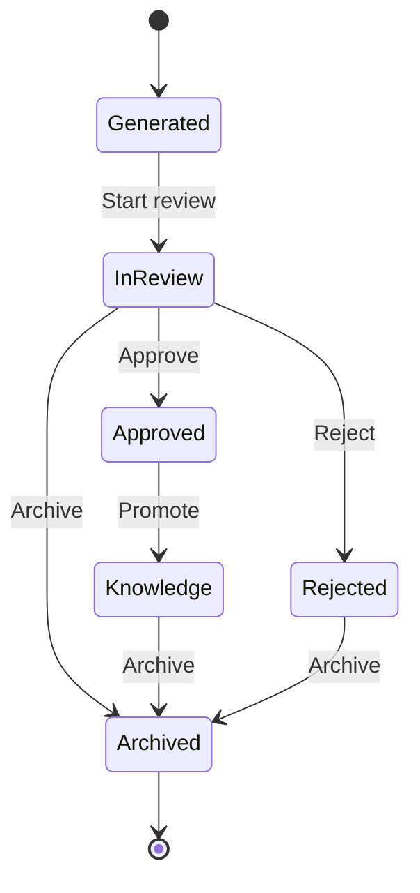

# Memory State Machine

## Purpose

This document defines the lifecycle of a Memory within AIOS.

A Memory represents organizational experience automatically generated from completed Work.

A Memory is **not** considered reusable organizational knowledge until it has been reviewed and approved by a human Member.

---

# Lifecycle



---

# States

## Generated

A Memory has been automatically created after a Work is completed.

Generated Memories are considered drafts.

### Allowed Actions

- View
- Start review

Editing is not permitted.

---

## In Review

A Member is reviewing the generated Memory.

### Allowed Actions

- Approve
- Reject
- Archive

Reviewers may provide comments explaining their decision.

---

## Approved

The Memory has been verified as factually accurate.

Approved Memories remain historical records.

They are **not yet organizational Knowledge**.

### Allowed Actions

- Promote to Knowledge
- Archive

---

## Knowledge

The Memory has been promoted into reusable organizational Knowledge.

Knowledge becomes available for future AI assistance and organizational search.

### Allowed Actions

- View
- Archive

Knowledge is immutable.

---

## Rejected

The generated Memory has been rejected.

Rejected Memories remain part of the audit history but are never reused.

### Allowed Actions

- View
- Archive

---

## Archived

The Memory is retained for historical purposes.

Archived Memories are read-only.

---

# Allowed Transitions

| From | To | Condition |
|------|----|-----------|
| Generated | In Review | Review started |
| In Review | Approved | Approved by reviewer |
| In Review | Rejected | Rejected by reviewer |
| In Review | Archived | Archived |
| Approved | Knowledge | Promoted |
| Approved | Archived | Archived |
| Rejected | Archived | Archived |
| Knowledge | Archived | Archived |

No other transitions are permitted.

---

# Invariants

The following rules must always be true.

## General

- Every Memory belongs to exactly one Organization.
- Every Memory originates from exactly one completed Work.
- Every Memory references the Decisions that influenced the Work.
- Every Memory records the AI model that generated it.
- Every state transition is recorded with actor and timestamp.

---

## Generated

- Generated automatically when a Work is completed.
- Exactly one Memory is generated for each completed Work.
- Generation occurs only once.
- Human Members cannot create Memories manually.

---

## In Review

- Review must be performed by an active Member.
- AI cannot review or approve a Memory.
- Review comments are preserved.

---

## Approved

- Approved Memories are verified historical records.
- Approval timestamp is immutable.
- Approved content cannot be edited.

---

## Knowledge

- Knowledge originates from one approved Memory.
- Knowledge is reusable across future Work within the same Organization.
- AI may reference Knowledge when assisting Members.
- Knowledge cannot be modified directly.

---

## Rejected

- Rejection reason is required.
- Rejected Memories are excluded from AI retrieval.
- Rejected Memories cannot become Knowledge.

---

## Archived

- Archived records remain searchable for audit purposes.
- Archived Knowledge is excluded from active recommendations.

---

# Relationship to Work

Memory is created automatically after a Work reaches the **Completed** state.

A Memory always references:

- Organization
- Work
- Decisions
- Participants
- Timeline
- AI contributions

A Memory cannot exist without a completed Work.

---

# Relationship to Knowledge

Knowledge is not created independently.

Promotion always follows this sequence:

```text
Completed Work
        ↓
Generated Memory
        ↓
Human Review
        ↓
Approved Memory
        ↓
Knowledge
```

Knowledge always maintains a reference to the Memory from which it originated.

---

# AI Behavior

The Secretary is responsible for generating the initial Memory.

The Secretary may:

- Summarize the Work
- Extract important Decisions
- Identify lessons learned
- Organize the timeline

The Secretary must not:

- Approve a Memory
- Reject a Memory
- Promote Knowledge
- Modify historical records after approval

All approval actions require a human Member.

---

# Audit Requirements

Every Memory must preserve:

- Organization
- Source Work
- Related Decisions
- Participants
- Generated summary
- Lessons learned
- AI model and prompt version
- Current state
- Review history
- Promotion history
- Created timestamp
- Review timestamp
- Promotion timestamp (if applicable)

Audit information must remain immutable.

---

# Domain Events

The following domain events may be emitted.

- MemoryGenerated
- MemoryReviewStarted
- MemoryApproved
- MemoryRejected
- MemoryPromoted
- MemoryArchived

---

# Related Documents

- docs/product/mvp.md
- docs/product/use-cases/mvp.md
- docs/architecture/state-machines/work.md
- docs/architecture/state-machines/decision.md