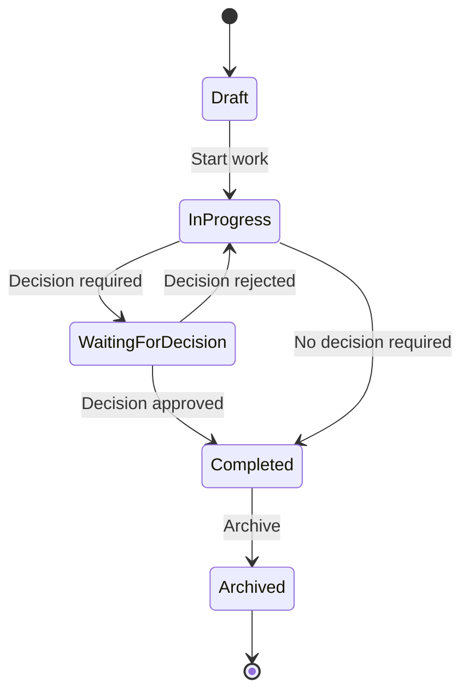

# Work State Machine

## Purpose

This document defines the lifecycle of a Work within AIOS.

A Work represents a business activity performed by members of an organization.

The state machine ensures that every Work follows a consistent lifecycle and that business rules remain enforceable throughout implementation.

---

# Lifecycle

---

# States

## Draft

A Work has been created but has not yet started.

### Allowed Actions

- Edit title
- Edit description
- Assign members
- Delete work
- Start work

---

## In Progress

The Work is actively being performed.

### Allowed Actions

- Update details
- Assign or unassign members
- Collaborate with the Secretary
- Request a Decision
- Complete the Work (if no Decision is required)

---

## Waiting for Decision

The Work is paused while awaiting a human decision.

### Allowed Actions

- Review proposal
- Approve Decision
- Reject Decision

The Work cannot be completed until the required Decision has been resolved.

---

## Completed

The objective of the Work has been achieved.

Completion triggers automatic Memory generation.

### Allowed Actions

- View
- Archive

Editing business data is not permitted.

---

## Archived

The Work is retained for historical reference.

Archived Work is read-only.

---

# Allowed Transitions

| From | To | Condition |
|------|----|-----------|
| Draft | In Progress | Work started |
| In Progress | Waiting for Decision | Decision required |
| Waiting for Decision | In Progress | Decision rejected |
| Waiting for Decision | Completed | Decision approved |
| In Progress | Completed | No Decision required |
| Completed | Archived | Archived by member |

No other transitions are permitted.

---

# Invariants

The following rules must always be true.

## Draft

- A Draft Work belongs to exactly one Organization.
- A Draft Work has at least one creator.
- A Draft Work may have zero or more assignees.

---

## In Progress

- Only active Members may modify the Work.
- The Work must belong to exactly one Organization.
- Every modification is recorded in the activity history.

---

## Waiting for Decision

- An active Decision must exist.
- Only authorized Members may approve or reject the Decision.
- The Work cannot be completed until the Decision is resolved.

---

## Completed

- The Work objective has been fulfilled.
- The completion timestamp is immutable.
- Exactly one Memory is generated automatically.
- Completed Work cannot return to a previous state.

---

## Archived

- Archived Work is immutable.
- Archived Work cannot be reopened.
- Historical records remain available for audit and Replay.

---

# Domain Events

The following domain events may be emitted.

- WorkCreated
- WorkStarted
- DecisionRequested
- WorkCompleted
- WorkArchived

---

# AI Behavior

The Secretary assists during active work only.

| State | Secretary Behavior |
|--------|--------------------|
| Draft | Organize and improve the Work |
| In Progress | Assist collaboration and drafting |
| Waiting for Decision | Summarize context and supporting information |
| Completed | Generate organizational Memory |
| Archived | No interaction |

The Secretary never changes the Work state autonomously.

---

# Related Documents

- docs/product/mvp.md
- docs/product/use-cases/mvp.md
- docs/architecture/state-machines/decision.md
- docs/architecture/state-machines/memory.md