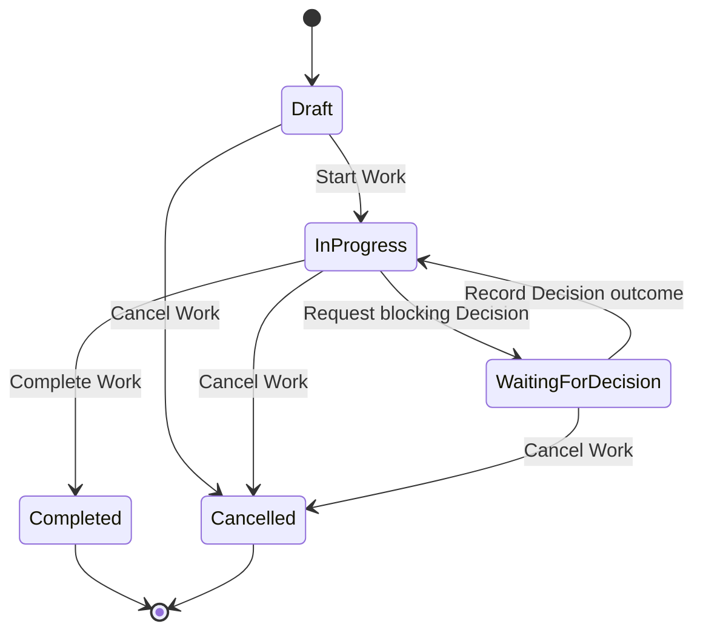

# Work State Machine
> **Document status:** Proposed  
> **Blueprint version:** 0.2.1  
> **Applies to:** Work Aggregate
## Purpose
This document defines the lifecycle of `Work` within AIOS.
A Work represents an Organization-owned unit of activity performed toward an intended outcome.
The state machine establishes:
- the valid Work states;
- the commands that may change state;
- the conditions required for each transition;
- the relationship between Work and Decision;
- the effect of Work completion on Memory generation;
- the authority boundaries for Human Members, AI Principals, and System Principals; and
- the local invariants that the Work Aggregate must protect.
The central rule is:
> A Decision may permit Work to continue or become eligible for completion, but only an explicit Work command may complete the Work.
Decision approval never completes Work automatically.
---
# Scope
This document defines the business lifecycle of one Work Aggregate.
It does not define:
- the internal lifecycle of a Decision;
- the internal lifecycle of a Memory;
- Knowledge promotion;
- workflow templates;
- arbitrary workflow configuration;
- multi-agent task execution; or
- archival and retention policy.
Archival is treated as an orthogonal visibility or retention concern in the MVP, not as a Work lifecycle state.
---
# State Summary
| State | Meaning | Business editing | Terminal |
|---|---|---:|---:|
| `Draft` | Work has been created but has not started | Yes | No |
| `InProgress` | Work is actively being performed | Yes | No |
| `WaitingForDecision` | Work is blocked by one unresolved Decision | Limited | No |
| `Completed` | Work was explicitly completed by an authorized human | No | Yes |
| `Cancelled` | Work was explicitly stopped without completion | No | Yes |
The MVP does not support reopening `Completed` or `Cancelled` Work.
---
# Lifecycle

`Record Decision outcome` returns the Work to `InProgress` regardless of whether the Decision was approved, rejected, or withdrawn.
The recorded outcome determines whether the completion gate is satisfied.
Returning to `InProgress` does not imply that the Work may be completed.
---
# State Definitions
## Draft
`Draft` means the Work exists but active execution has not begun.
### Allowed Actions
An authorized Human Member may:
- edit the title;
- edit the description;
- define the intended outcome;
- assign responsible Members;
- add participants;
- add initial context;
- start the Work; or
- cancel the Work.
The Secretary may:
- draft or improve the description;
- suggest missing context;
- propose an intended outcome; and
- organize initial information.
The Secretary cannot start or cancel the Work.
### State Rules
- `startedAt` is absent.
- `completedAt` is absent.
- `cancelledAt` is absent.
- No blocking Decision may be pending.
- A Draft is not eligible for Memory generation.
---
## InProgress
`InProgress` means the Work is actively being performed.
### Allowed Actions
An authorized Human Member may:
- update permitted Work details;
- update assignments and participants;
- record progress;
- collaborate with the Secretary;
- link non-blocking Decisions;
- request one blocking Decision;
- complete the Work when all completion guards pass; or
- cancel the Work.
The Secretary may:
- summarize progress;
- draft artifacts;
- identify unresolved questions;
- suggest a Decision;
- prepare Decision context; and
- suggest next actions.
The Secretary cannot request a binding approval, complete the Work, or cancel the Work without an explicit human command.
### State Rules
- `startedAt` is present and immutable.
- No unresolved blocking Decision is pending.
- The Work may still have an unsatisfied completion gate after a rejected or withdrawn Decision.
- Completion is permitted only when all local completion guards pass.
---
## WaitingForDecision
`WaitingForDecision` means the Work is blocked by exactly one unresolved Decision.
The Work remains active, but completion is prohibited while the blocking Decision is unresolved.
### Allowed Actions
An authorized Human Member may:
- view and update non-authoritative context;
- add supporting information to the related Decision through the Decision use case;
- collaborate with the Secretary;
- cancel the Work; and
- view the Decision review status.
A System Principal may record the resolved Decision outcome only in response to a valid Decision domain or integration event.
### Prohibited Actions
The Work cannot:
- be completed;
- request a second blocking Decision;
- replace the current blocking Decision silently; or
- infer a Decision result from AI output.
### State Rules
- A `blockingDecisionId` is present.
- The corresponding completion gate is `Pending`.
- Only one unresolved blocking Decision may exist for the Work in the MVP.
- The Decision and Work must belong to the same Organization.
- The Work returns to `InProgress` only after an explicit Decision outcome is recorded.
---
## Completed
`Completed` means an authorized Human Member explicitly confirmed that the Work reached its completion condition.
Completion is a business fact.
It is not inferred from:
- Decision approval;
- an AI recommendation;
- elapsed time;
- task progress;
- external event delivery; or
- Memory generation success.
### Allowed Actions
Users may:
- view the Work;
- view related Decisions;
- view the resulting Memory process;
- add non-mutating audit annotations where supported; and
- hide or archive the Work through a separate retention or view mechanism.
### State Rules
- `completedAt` is present and immutable.
- `completedBy` identifies the Human Member who completed the Work.
- `cancelledAt` is absent.
- Business content is immutable.
- The Work cannot return to a previous state.
- Exactly one `WorkCompleted` domain event is recorded for the successful transition.
- Memory generation is requested durably after completion.
Memory generation failure does not reopen or invalidate the Work.
---
## Cancelled
`Cancelled` means an authorized Human Member explicitly stopped the Work without completing it.
### Allowed Actions
Users may:
- view the Work;
- view the cancellation reason;
- view related Decisions and history; and
- hide or archive the Work through a separate retention or view mechanism.
### State Rules
- `cancelledAt` is present and immutable.
- `cancelledBy` identifies the Human Member who cancelled the Work.
- A cancellation reason is required.
- `completedAt` is absent.
- The Work cannot return to a previous state.
- Cancellation does not trigger Memory generation in the MVP.
A future roadmap phase may define a separate learning process for cancelled Work.
---
# Commands and Transitions
## Create Work
### Transition
```text
[*] → Draft
```
### Preconditions
- The Organization exists.
- The acting Human Member is active in the Organization.
- The acting Human Member has permission to create Work.
- Required initial fields are valid.
### Effects
- Create the Work in `Draft`.
- Record the creator and Organization.
- Emit `WorkCreated`.
---
## Start Work
### Transition
```text
Draft → InProgress
```
### Preconditions
- The actor is an authorized Human Member.
- The Work has an intended outcome.
- Any required assignment or ownership fields are present.
- The command uses the expected Aggregate version.
### Effects
- Set `startedAt`.
- Record the actor.
- Emit `WorkStarted`.
`startedAt` cannot later be changed.
---
## Request Blocking Decision
### Transition
```text
InProgress → WaitingForDecision
```
### Preconditions
- The actor is an authorized Human Member.
- No unresolved blocking Decision already exists.
- A valid `decisionId` has been assigned by the coordinated Decision use case.
- The Decision belongs to the same Organization.
- The Decision is related to this Work.
- The Decision is unresolved.
### Effects
- Store `blockingDecisionId`.
- Set the completion gate to `Pending`.
- Record the requesting actor.
- Emit `WorkDecisionRequested`.
The Application Layer coordinates creation or selection of the related Decision.
The Work Aggregate does not create or approve the Decision internally.
---
## Record Decision Outcome
### Transition
```text
WaitingForDecision → InProgress
```
### Supported Outcomes
- `Approved`
- `Rejected`
- `Withdrawn`
### Preconditions
- The supplied `decisionId` matches the current `blockingDecisionId`.
- The completion gate is `Pending`.
- The outcome comes from an authoritative Decision event.
- The Decision belongs to the same Organization.
- The event has not already been applied.
### Effects
For `Approved`:
- record the Decision outcome as `Approved`;
- mark the completion gate `Satisfied`; and
- return the Work to `InProgress`.
For `Rejected` or `Withdrawn`:
- record the Decision outcome;
- mark the completion gate `Unsatisfied`; and
- return the Work to `InProgress`.
In all cases:
- preserve the Decision reference;
- record the originating human actor from the Decision event;
- record the technical processing principal separately where applicable; and
- emit `WorkDecisionOutcomeRecorded`.
A rejected or withdrawn outcome does not permit completion when approval remains required.
The Work may request a new blocking Decision from `InProgress`.
---
## Complete Work
### Transition
```text
InProgress → Completed
```
### Preconditions
- The actor is an authorized Human Member.
- The Work is currently `InProgress`.
- No blocking Decision is pending.
- The completion gate is either:
  - not required; or
  - satisfied by an Approved Decision.
- Required local completion data is present.
- The command uses the expected Aggregate version.
### Effects
- Set `completedAt`.
- Set `completedBy`.
- Make business content immutable.
- Emit one `WorkCompleted` domain event.
- Persist the event through the Transactional Outbox.
Completion remains explicit even when a related Decision has been approved.
---
## Cancel Work
### Transition
```text
Draft → Cancelled
InProgress → Cancelled
WaitingForDecision → Cancelled
```
### Preconditions
- The actor is an authorized Human Member.
- The Work is not already terminal.
- A cancellation reason is provided.
- The command uses the expected Aggregate version.
### Effects
- Set `cancelledAt`.
- Set `cancelledBy`.
- Preserve the cancellation reason.
- Preserve any related Decision history.
- Emit `WorkCancelled`.
Cancelling a Work does not cancel or withdraw a related Decision automatically.
The Application Layer must coordinate any separate Decision action explicitly.
---
# Allowed Transition Table
| From | Command | To | Primary Guard |
|---|---|---|---|
| `[*]` | Create Work | `Draft` | Authorized creator |
| `Draft` | Start Work | `InProgress` | Required start data present |
| `Draft` | Cancel Work | `Cancelled` | Human actor and reason |
| `InProgress` | Request Blocking Decision | `WaitingForDecision` | No unresolved blocking Decision |
| `InProgress` | Complete Work | `Completed` | Completion gate satisfied |
| `InProgress` | Cancel Work | `Cancelled` | Human actor and reason |
| `WaitingForDecision` | Record Decision Outcome | `InProgress` | Matching authoritative Decision outcome |
| `WaitingForDecision` | Cancel Work | `Cancelled` | Human actor and reason |
No other business state transitions are permitted in the MVP.
---
# Completion Gate
The Work Aggregate maintains a local completion-gate snapshot sufficient to protect Work completion.
Possible values are:
```text
NotRequired
Pending(decisionId)
Satisfied(decisionId, approvedAt, approvedBy)
Unsatisfied(decisionId, outcome, resolvedAt, resolvedBy)
```
The completion gate is not the source of truth for the Decision.
The Decision Aggregate remains authoritative for Decision content, review history, and resolution.
The Work snapshot exists only to enforce Work-local transition rules without querying another Aggregate from inside the Work Aggregate.
The Application Layer updates the snapshot from authoritative Decision events.
---
# Relationship to Decision
A Work may have multiple related Decisions over time.
For the MVP:
- only one unresolved blocking Decision may exist at a time;
- other non-blocking Decisions may remain related to the Work;
- Decision state is owned by the Decision Aggregate;
- Work state is owned by the Work Aggregate;
- Decision approval satisfies a completion gate;
- Decision approval does not complete Work;
- Decision rejection does not complete Work;
- Decision withdrawal does not complete Work; and
- Work cancellation does not automatically change Decision state.
The normal approved flow is:
```text
Work: InProgress
        ↓ Request blocking Decision
Work: WaitingForDecision
        ↓ Human approves Decision
Decision: Approved
        ↓ Record authoritative outcome
Work: InProgress
        ↓ Human explicitly completes Work
Work: Completed
```
The rejected flow is:
```text
Work: WaitingForDecision
        ↓ Human rejects Decision
Decision: Rejected
        ↓ Record authoritative outcome
Work: InProgress
Completion gate: Unsatisfied
```
The Work must then:
- request another blocking Decision; or
- be cancelled.
It cannot be completed while the required approval remains unsatisfied.
---
# Relationship to Memory
Successful Work completion starts the Memory generation process.
The sequence is:
```text
Human completes Work
        ↓
Work Aggregate commits Completed
        ↓
WorkCompleted stored in Transactional Outbox
        ↓
Background processing requests Memory generation
        ↓
Memory generation succeeds or fails independently
```
The Work Aggregate guarantees only that:
- the `WorkCompleted` transition occurs once;
- the completion event is recorded durably with the transaction; and
- the event contains the identifiers required for downstream processing.
The Memory module is responsible for:
- idempotent generation requests;
- preventing duplicate active Memory for one Work;
- generation status;
- retry behavior;
- Memory lifecycle; and
- human review.
The rule “one active Memory per completed Work” is not a Work Aggregate invariant.
Memory generation failure:
- does not reverse Work completion;
- does not change Work back to `InProgress`;
- must be visible operationally; and
- may be retried safely.
---
# Aggregate Invariants
The Work Aggregate must always enforce the following local invariants.
## Identity and Ownership
- Every Work has exactly one `workId`.
- Every Work belongs to exactly one Organization.
- Organization ownership cannot change after creation.
- Every Work has exactly one creator.
- The creator reference cannot change.
## State
- The Work is in exactly one lifecycle state.
- Only transitions listed in this document are valid.
- Terminal Work cannot return to a non-terminal state.
- Every successful transition records actor and timestamp.
- State timestamps are immutable after being set.
## Decision Gate
- At most one blocking Decision is pending at a time.
- `WaitingForDecision` requires a pending completion gate.
- A pending completion gate requires a `blockingDecisionId`.
- `InProgress` cannot retain a pending completion gate.
- A Decision outcome may be recorded only for the matching pending Decision.
- The same Decision outcome event cannot be applied twice.
## Completion
- Only `InProgress` Work may become `Completed`.
- A pending completion gate prohibits completion.
- An unsatisfied required gate prohibits completion.
- Only an authorized Human Member may complete Work.
- `completedAt` and `completedBy` are set together.
- Completed Work has no cancellation timestamp.
## Cancellation
- Only non-terminal Work may be cancelled.
- A cancellation reason is required.
- `cancelledAt` and `cancelledBy` are set together.
- Cancelled Work has no completion timestamp.
## Immutability
- Completed and Cancelled Work are read-only for business data.
- Audit annotations must not alter historical business content.
- Organization, creator, completion record, and cancellation record are immutable.
---
# Cross-Aggregate Preconditions
The following rules are required but are not enforced by the Work Aggregate alone:
- the Organization exists;
- the acting Member is active;
- the acting Member has the required permission;
- the related Decision exists;
- the Decision and Work belong to the same Organization;
- the Decision is authoritative and resolved;
- downstream Memory generation is unique and idempotent.
These rules are enforced through a combination of:
- Application Services;
- authorization policies;
- repositories;
- database constraints;
- Transactional Outbox processing;
- idempotent handlers; and
- coordinated process logic.
They must not be mislabeled as Work Aggregate invariants.
---
# Domain Events
The Work Aggregate may emit:
- `WorkCreated`
- `WorkStarted`
- `WorkDecisionRequested`
- `WorkDecisionOutcomeRecorded`
- `WorkCompleted`
- `WorkCancelled`
Each event must include:
- event identifier;
- event type;
- Work identifier;
- Organization identifier;
- Aggregate version;
- occurred-at timestamp;
- acting principal;
- and transition-specific data.
`WorkDecisionOutcomeRecorded` must also preserve:
- Decision identifier;
- Decision outcome;
- originating human actor;
- Decision resolution timestamp; and
- technical processing principal where applicable.
`WorkCompleted` must contain enough information to request Memory generation without querying mutable Work state later.
A separate integration event such as `MemoryGenerationRequested` may be derived from `WorkCompleted` by the Application Layer or outbox dispatcher.
---
# Concurrency and Idempotency
The implementation must use optimistic concurrency or an equivalent mechanism.
Each state-changing command must include or validate an expected Aggregate version.
When concurrent commands conflict:
- only one valid transition is committed;
- stale commands fail with a conflict result; and
- the caller must reload the Work before retrying.
Event handlers must be idempotent.
In particular:
- a duplicated Decision outcome event must not apply the outcome twice;
- a duplicated `WorkCompleted` delivery must not create duplicate Memory;
- retrying the same completion command must not emit another completion event; and
- out-of-order Decision events must be rejected or ignored safely.
---
# Authority Model
## Human Member
Only an authorized Human Member may:
- start Work;
- request a binding blocking Decision;
- complete Work; or
- cancel Work.
## Secretary
The Secretary is an AI Principal.
It may:
- draft;
- summarize;
- organize;
- identify risks;
- recommend a Decision;
- prepare completion information; and
- generate a Memory draft after completion through the Memory process.
It may not:
- change Work state;
- mark a completion gate satisfied;
- approve a Decision;
- complete Work;
- cancel Work; or
- impersonate a Human Member.
## System Principal
A System Principal may perform technical processing such as:
- applying an authoritative Decision outcome;
- dispatching outbox events;
- requesting Memory generation; and
- retrying failed technical operations.
A System Principal does not make the underlying business judgment.
Audit records must distinguish:
- the Human Member who made the Decision; and
- the System Principal that applied its technical consequence.
---
# Failure Semantics
## Decision Outcome Processing Failure
If an authoritative Decision is resolved but the Work update fails:
- the Decision remains resolved;
- the Work remains in `WaitingForDecision` until processing succeeds;
- the event is retried;
- duplicate application is prevented; and
- the failure is visible to operations.
The system must not infer that the Work is completed.
## Work Completion Processing Failure
If the Work completion transaction fails:
- the Work remains `InProgress`;
- no `WorkCompleted` event is committed; and
- no Memory generation request is valid.
## Memory Generation Failure
If Memory generation fails after Work completion:
- the Work remains `Completed`;
- the failure is recorded outside the Work lifecycle;
- retry is permitted; and
- the user can see that Memory is not yet available.
---
# Audit Requirements
Every Work must preserve:
- Work identifier;
- Organization identifier;
- creator;
- intended outcome;
- responsible Members;
- participants;
- current state;
- Aggregate version;
- started timestamp and actor;
- current completion-gate snapshot;
- related blocking Decision reference;
- recorded Decision outcomes;
- completed timestamp and actor, when applicable;
- cancelled timestamp, actor, and reason, when applicable;
- state-transition history; and
- Secretary contributions where applicable.
Audit history must distinguish human, AI, and system actions.
Historical records must not be silently overwritten.
---
# Acceptance Scenarios
## Complete Work Without a Decision
```text
Given Work is InProgress
And no completion approval is required
When an authorized Human Member completes the Work
Then Work becomes Completed
And WorkCompleted is recorded once
And Memory generation is requested durably
```
## Approved Decision Does Not Complete Work
```text
Given Work is WaitingForDecision
When the blocking Decision is approved
And the authoritative outcome is recorded
Then Work becomes InProgress
And the completion gate becomes Satisfied
But Work is not Completed
```
## Explicit Completion After Approval
```text
Given Work is InProgress
And its required completion gate is Satisfied
When an authorized Human Member completes the Work
Then Work becomes Completed
```
## Rejected Decision Blocks Completion
```text
Given Work is WaitingForDecision
When the blocking Decision is rejected
And the authoritative outcome is recorded
Then Work becomes InProgress
And the completion gate becomes Unsatisfied
And completing the Work is rejected
```
## Duplicate Completion Delivery
```text
Given Work has already become Completed
When WorkCompleted is delivered again
Then no duplicate active Memory is created
And Work state remains Completed
```
## Memory Generation Failure
```text
Given Work is Completed
When Memory generation fails
Then Work remains Completed
And the failure is visible
And generation may be retried safely
```
---
# Related Documents
- `docs/architecture/overview.md`
- `docs/product/mvp.md`
- `docs/product/roadmap.md`
- `docs/product/use-cases/mvp.md`
- `docs/architecture/state-machines/decision.md`
- `docs/architecture/state-machines/memory.md`
- `docs/domain/aggregates/work.md`
- `docs/architecture/authorization.md`
