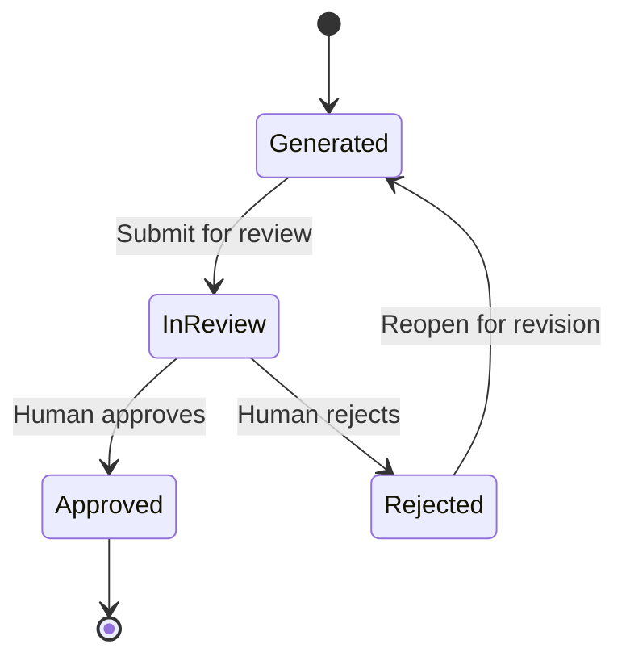

# MVP

> **Document status:** Proposed  
> **Blueprint version:** 0.2.1  
> **Implementation target:** AIOS MVP

## Purpose

This document defines the implementation scope of the Minimum Viable Product (MVP) for AIOS.

The MVP is the smallest coherent version of AIOS that can validate the core product hypothesis while preserving the architectural and domain principles of the full Blueprint.

This document is an implementation contract. It defines:

- the product outcome the MVP must deliver;
- the capabilities included in the first release;
- the authority boundaries between humans, AI, and system processes;
- the lifecycle that must exist from Work to Decision to Memory;
- the capabilities that are intentionally deferred; and
- the minimum technical constraints required to implement the MVP safely.

The complete AIOS Blueprint describes a broader target system. A concept appearing in the Blueprint does not imply that it must be implemented in the MVP.

---

# Product Hypothesis

AIOS is based on the following hypothesis:

> Organizations become more effective when AI assists daily work and organizational experience is captured, reviewed by humans, and retained as trustworthy history.

The MVP must validate whether a small organization can complete the following loop:

```text
Collaborative Work
        ↓
Recorded Decisions
        ↓
Completed Work
        ↓
AI-generated Memory draft
        ↓
Human Review
        ↓
Approved Organizational Memory
```

The MVP does not attempt to validate the complete organizational learning model.

In particular, it does not convert approved Memory into reusable Knowledge or Capability.

---

# Product Goal

Enable small organizations to collaborate with one AI Secretary on everyday work, record meaningful decisions, and accumulate human-approved organizational Memory.

The MVP must provide value even without:

- Knowledge promotion;
- Capability extraction;
- multiple AI Employees;
- workflow automation;
- semantic retrieval; or
- external integrations.

The first release is successful when the core loop is understandable, trustworthy, and usable without relying on future Blueprint capabilities.

---

# Target Users

The initial target users are:

- small product teams with approximately 2–10 members;
- early-stage startups;
- internal teams validating AI-assisted organizational workflows; and
- teams that need to preserve the context and outcomes of completed work.

The MVP is not designed for:

- enterprise-scale administration;
- highly regulated deployment;
- complex matrix organizations;
- public multi-tenant marketplaces; or
- personal productivity outside an Organization.

A person may belong to more than one Organization, but information owned by one Organization must never be exposed to another.

---

# MVP Design Principles

## Human Authority

Human Members retain all organizational authority.

AI may assist with analysis, drafting, summarization, and suggestions, but AI must never perform a business approval that belongs to a human.

## Review Before Trust

AI-generated content is not automatically trusted organizational history.

A generated Memory becomes approved organizational history only after human review.

## History Before Knowledge

The MVP captures what happened.

It does not yet determine which experience should become reusable organizational Knowledge.

## Explicit State Transitions

Business state changes must be explicit, authorized, and auditable.

Derived assumptions must not silently change Work, Decision, or Memory state.

## Organization Isolation

Organization is the primary ownership and authorization boundary.

It is not a transaction boundary across all domain objects.

## Simple Initial Architecture

The first implementation must favor a Modular Monolith and durable internal event delivery over premature service decomposition.

## Blueprint Is Larger Than MVP

Knowledge, Evidence, Capability, AI Employees, external knowledge, and advanced retrieval remain valid Blueprint concepts even though they are not implemented in the MVP.

---

# MVP Boundary

## Included Domains and Capabilities

The MVP includes:

- authentication;
- Organization management;
- Member management;
- organization-scoped authorization;
- Personal Workspace views;
- Organization Workspace views;
- Work management;
- Decision management;
- one Secretary per Organization;
- AI-assisted drafting and summarization;
- automatic Memory generation after Work completion;
- human Memory review;
- Memory approval and rejection;
- immutable approved Memory;
- basic notifications;
- audit and traceability; and
- durable asynchronous processing for Memory generation.

## Explicitly Excluded Domains and Capabilities

The MVP excludes:

- Knowledge;
- Knowledge promotion;
- Evidence as an independent domain object;
- Capability;
- Capability extraction;
- Organization Brain;
- Replay;
- semantic retrieval;
- embeddings and vector search;
- external knowledge ingestion;
- AI Employees;
- multiple specialized AI roles;
- multi-agent orchestration;
- autonomous business execution;
- MemoryRevision;
- post-approval Memory editing;
- custom workflow design;
- advanced policy administration;
- marketplace;
- plugin system;
- public API;
- SDK; and
- enterprise governance features.

---

# Core Product Flow

The canonical MVP flow is:

```text
1. A human creates or joins an Organization.
2. Human Members create and collaborate on Work.
3. Human Members record Decisions related to that Work.
4. A human explicitly completes the Work.
5. AIOS durably requests Memory generation.
6. The Secretary generates one editable Memory draft.
7. A human submits the draft for review.
8. A human reviewer approves or rejects the Memory.
9. An Approved Memory becomes immutable organizational history.
```

Decision approval does not automatically complete Work.

Work completion is a separate, explicit business action.

Memory generation failure does not reverse Work completion.

---

# Functional Scope

## Authentication

The MVP must support:

- sign in;
- sign out;
- account identity;
- basic Member profile management; and
- secure session handling.

Authentication establishes who the person is.

Authorization determines what that person may do inside a specific Organization.

The MVP does not require:

- enterprise single sign-on;
- SCIM provisioning;
- delegated identity administration; or
- external identity federation beyond the selected initial authentication mechanism.

---

## Organization

A human may create an Organization.

An Organization is the ownership boundary for:

- Memberships;
- Work;
- Decisions;
- Memory;
- Secretary activity;
- audit records; and
- organization-scoped notifications.

The MVP must support:

- Organization creation;
- Organization naming;
- basic Organization settings;
- Member invitation;
- invitation acceptance;
- Member removal or deactivation; and
- viewing active Members.

Every organization-owned object must reference exactly one Organization.

Cross-Organization references between Work, Decision, and Memory are not permitted.

Deleting an Organization and long-term retention policy are not required for the first release unless required by the selected deployment environment.

---

## Member

A Member represents a human participant within an Organization.

A person may have Memberships in multiple Organizations.

The MVP requires a minimal role model sufficient to:

- administer an Organization;
- manage Memberships;
- create and update Work;
- participate in Decisions;
- complete Work; and
- review Memory.

The exact role names may evolve, but authorization must follow these rules:

- access is denied unless explicitly permitted;
- permissions are evaluated within one Organization;
- AI does not inherit human Member permissions;
- technical background processes do not receive business approval authority; and
- every protected action records the acting principal.

Advanced custom roles and policy editors are outside the MVP.

---

## Workspace

The MVP provides two workspace experiences.

### Personal Workspace

The Personal Workspace is a personalized view for a human Member.

It may display:

- assigned Work;
- Work requiring attention;
- pending Decision reviews;
- pending Memory reviews;
- recent activity; and
- notifications.

The Personal Workspace is not a separate domain or ownership boundary.

Items displayed there remain owned by their Organization.

The MVP is not a general-purpose private task manager outside an Organization.

### Organization Workspace

The Organization Workspace is a shared view of organization-owned activity.

It may display:

- active and completed Work;
- related Decisions;
- Organization Members;
- approved Memory;
- pending reviews; and
- recent organizational activity.

The Organization Workspace is a presentation and navigation concept.

It is not an Aggregate and does not create a transaction boundary across the Organization.

---

## Work

Work represents a unit of organizational activity that produces an outcome.

Human Members must be able to:

- create Work;
- edit Work while its state permits editing;
- define its purpose or expected outcome;
- assign responsible Members;
- add participants;
- track status;
- link Decisions;
- record progress;
- cancel Work when permitted; and
- complete Work explicitly.

The Secretary may assist with:

- drafting Work descriptions;
- summarizing progress;
- identifying unresolved questions;
- organizing activity; and
- suggesting next actions.

The Secretary must not:

- create binding commitments without human confirmation;
- assign human responsibility autonomously;
- cancel Work;
- complete Work; or
- bypass Work invariants.

### Work Completion

Completing Work must be an explicit action performed by an authorized human Member.

A Work may be completed only when its own state and required local data allow completion.

Decision approval alone does not complete Work.

When Work is completed:

- the Work completion transition is committed first;
- a durable Memory generation request is recorded;
- Memory generation occurs asynchronously;
- generation may be retried safely; and
- a generation failure does not reopen or invalidate the completed Work.

Detailed state transitions belong to the Work state machine document.

---

## Decision

Decision represents an explicit organizational choice made in the context of Work or organizational activity.

Human Members must be able to:

- create a Decision;
- describe the question or proposal;
- record relevant context;
- associate the Decision with Work when applicable;
- submit the Decision for review;
- approve or reject the Decision;
- record the outcome;
- record the acting reviewer; and
- view Decision history.

The Secretary may:

- summarize the decision context;
- draft alternatives;
- identify trade-offs;
- organize supporting information;
- highlight unresolved assumptions; and
- prepare a recommendation.

The Secretary must not:

- approve a Decision;
- reject a Decision;
- impersonate a human reviewer;
- publish a Decision as binding without human action; or
- automatically complete related Work.

An Approved Decision records a human-authorized organizational choice.

It may influence Work, but any resulting Work state change must occur through an explicit Work command.

Detailed state transitions belong to the Decision state machine document.

---

## Secretary

The MVP supports one Secretary for each Organization.

Secretary is a domain concept representing an AI Principal that assists the Organization.

The Secretary is not a human Member.

The Secretary may:

- summarize discussions and activity;
- draft documents;
- draft Work descriptions;
- prepare Decision material;
- suggest improvements;
- organize information;
- identify missing context;
- generate Memory drafts; and
- explain the basis of its output when supporting information is available.

The Secretary must never:

- approve or reject a Decision;
- approve or reject a Memory;
- complete or cancel Work;
- invite or remove Members;
- grant or change permissions;
- change Organization ownership;
- publish binding organizational policy;
- promote Memory into Knowledge;
- act as a human Member; or
- modify approved historical records.

All Secretary outputs must be attributable to the Secretary and distinguishable from human-authored content.

The MVP does not include:

- multiple Secretaries in one Organization;
- specialized AI Employees;
- autonomous AI-to-AI delegation;
- AI hierarchy;
- agent marketplace; or
- self-modifying AI roles.

---

## Memory

Memory is a human-reviewable historical record generated from completed Work.

A Memory captures what happened during one specific Work.

It may include:

- Work purpose;
- final outcome;
- related Decisions;
- participants;
- relevant timeline;
- important context;
- AI contributions;
- lessons observed;
- unresolved issues;
- source references;
- generation timestamp;
- AI model identifier; and
- prompt or generation policy version.

Memory is organization-specific.

Memory is not reusable organizational Knowledge.

Approval confirms that the Memory is an acceptable historical representation of the completed Work.

Approval does not prove that every lesson is universally valid, and it does not create Knowledge.

### Generation

Memory generation begins only after Work has been completed.

The generation process must:

- use the completed Work as its source;
- include related Decisions available to the Organization;
- preserve source traceability;
- record AI generation metadata;
- tolerate temporary AI service failure;
- support safe retry; and
- avoid duplicate Memory creation.

The MVP maintains at most one active Memory Aggregate for each completed Work.

Generation retries must be idempotent.

### Draft Editing

A generated Memory begins as an editable draft.

Authorized human Members may:

- correct factual errors;
- add missing context;
- remove unsupported statements;
- refine wording; and
- prepare the draft for review.

The Secretary may suggest or apply draft changes only when those changes remain reviewable and attributable.

Submitting a Memory for review locks its content until the review outcome is recorded.

### Review

Memory review must be performed by an authorized human Member.

A reviewer may:

- approve the Memory;
- reject the Memory;
- provide review comments; and
- explain required changes.

AI cannot approve or reject Memory.

Review actions must record:

- reviewer;
- outcome;
- timestamp; and
- comments or rejection reason when required.

### Rejection and Resubmission

A Rejected Memory remains part of the audit history.

An authorized human may reopen the same Memory as an editable draft, revise it, and submit it again.

The MVP does not create a separate MemoryRevision object for pre-approval draft changes.

Draft edits and review transitions must remain auditable.

### Approval

An Approved Memory is immutable.

After approval:

- its approved content cannot be edited;
- its source Work reference cannot change;
- its Organization cannot change;
- its approval record cannot change; and
- it remains available as organizational history.

The MVP does not support correcting an Approved Memory in place.

A future MemoryRevision process may provide post-approval correction while preserving the original record.

### Memory Lifecycle



State meaning:

| State | Meaning | Editable |
|---|---|---:|
| Generated | AI-generated or reopened draft | Yes |
| InReview | Submitted and locked for human review | No |
| Rejected | Review failed; retained for audit until reopened | No |
| Approved | Verified organizational history | No |

Archival is not required as a separate MVP state.

Retention and visibility may be managed operationally without changing the historical meaning of an Approved Memory.

---

## Notifications

The MVP requires basic notifications for actions that need human attention.

Examples include:

- Organization invitation;
- Work assignment;
- Decision submitted for review;
- Decision outcome;
- Memory ready for review;
- Memory rejected;
- Memory approved; and
- Memory generation failure requiring intervention.

The MVP does not require:

- user-designed notification rules;
- cross-channel notification orchestration;
- advanced digest configuration; or
- enterprise escalation policies.

---

## Audit and Traceability

The MVP must preserve traceability across:

```text
Organization
    ↓
Work
    ↓
Decision
    ↓
Memory
```

Every important business transition must record:

- Organization;
- target object;
- previous state;
- next state;
- acting principal;
- timestamp; and
- relevant reason or review comment.

AI-generated artifacts must also record, where available:

- AI Principal;
- model identifier;
- prompt or policy version;
- generation timestamp; and
- source object references.

Audit information must not be silently overwritten.

The MVP does not require a separate enterprise audit-management product or configurable retention engine.

---

# Authority Model

The MVP distinguishes three actor categories conceptually.

## Human Member

A Human Member may receive organizational permissions and perform business approvals.

## AI Principal

The Secretary is an AI Principal.

It may assist and generate content but cannot receive human approval authority.

## System Principal

A System Principal performs technical operations such as background processing, event delivery, and retries.

A System Principal may execute a previously authorized technical action, but it cannot make a new business judgment.

Examples:

- a background worker may process a Memory generation request;
- it may not approve the generated Memory;
- an event handler may deliver a notification;
- it may not decide whether Work should be completed.

The detailed Actor Model is defined separately from this product scope document.

---

# Data Ownership and Isolation

The following rules apply throughout the MVP:

- every Work belongs to exactly one Organization;
- every Decision belongs to exactly one Organization;
- every Memory belongs to exactly one Organization;
- a Decision linked to Work must belong to the same Organization;
- a Memory and its source Work must belong to the same Organization;
- related Decisions included in Memory must belong to the same Organization;
- authorization checks must use the target Organization;
- cross-Organization queries must not reveal protected data; and
- a Secretary may access only the Organization context in which it operates.

Organization is an ownership and authorization boundary.

It is not a single Aggregate and does not require one transaction for all organization-owned changes.

---

# Implementation Constraints

## Architecture

The initial implementation must use a Modular Monolith.

Logical module boundaries should remain explicit even when modules are deployed together.

The MVP does not require independent microservices.

## Persistence

PostgreSQL is the default relational persistence technology for the MVP.

Domain invariants must not depend solely on user-interface validation.

Database constraints should reinforce domain rules where appropriate.

## Event Delivery

Events that trigger asynchronous work must use durable delivery.

The MVP should use:

- a Transactional Outbox;
- a background worker;
- idempotent handlers; and
- retry with observable failure handling.

An external message broker is not required for the MVP.

## AI Integration

AI calls must occur outside critical domain transactions.

AI failure must not corrupt committed domain state.

Generated output must be treated as untrusted input until validated and, where required, reviewed by a human.

## Authorization

Authorization follows default deny.

Every command must validate:

- authenticated principal;
- Organization scope;
- required permission; and
- current target state.

## Immutability

Approved Memory must be immutable at the domain and persistence layers.

Immutability must not rely only on disabling an edit button.

## Observability

The implementation must provide enough logging and operational visibility to diagnose:

- failed Memory generation;
- repeated retries;
- authorization denial;
- invalid state transition;
- event delivery failure; and
- unexpected AI response.

The MVP does not require a full enterprise observability platform.

---

# Out of Scope

## Knowledge and Organizational Learning

The following are outside the MVP:

- reviewing Memory for promotion into Knowledge;
- creating Knowledge from Memory;
- Knowledge lifecycle;
- Evidence collection as an independent domain process;
- Knowledge validation;
- Knowledge reuse;
- Organization Brain;
- semantic organizational search;
- Replay;
- learning optimization; and
- Capability extraction.

Approved Memory may become a source for future Knowledge, but no Knowledge command, state, event, or user interface is required in the MVP.

```text
Approved Memory
      ↓
MVP boundary ends here
```

## AI Organization

The following are outside the MVP:

- AI Employees;
- multiple AI roles;
- Secretary orchestration of other AI Principals;
- autonomous delegation;
- multi-agent collaboration;
- AI role marketplace; and
- AI performance management.

## Workflow Engine

The following are outside the MVP:

- custom workflow definitions;
- visual workflow designer;
- business process automation;
- user-defined state machines;
- conditional routing; and
- organization-specific automation rules.

## Platform

The following are outside the MVP:

- public API;
- SDK;
- plugin system;
- marketplace;
- third-party developer platform; and
- public extension registry.

Internal application interfaces may exist, but they are not a supported public platform contract.

## Enterprise Governance

The following are outside the MVP:

- advanced custom roles;
- policy authoring;
- legal hold;
- configurable retention;
- compliance certification;
- enterprise audit console;
- data residency controls;
- SCIM;
- enterprise SSO; and
- multi-level administrative delegation.

## Advanced Retrieval

The following are outside the MVP:

- embeddings;
- vector database;
- semantic ranking;
- retrieval-augmented generation over organizational Knowledge;
- external document ingestion; and
- cross-Organization search.

Basic structured retrieval of Work, Decision, and approved Memory remains in scope.

---

# Release Acceptance Criteria

The MVP is release-ready only when the following end-to-end behavior is demonstrable.

## Organization and Access

- A person can create an Organization.
- A person can invite another person.
- The invited person can join as a Member.
- Members cannot access another Organization without permission.
- Protected actions are denied by default.

## Work

- An authorized human can create, update, assign, and complete Work.
- Invalid Work transitions are rejected.
- Secretary suggestions do not change Work state automatically.
- Approving a Decision does not complete Work.

## Decision

- A human can create and submit a Decision.
- An authorized human can approve or reject it.
- The acting human and outcome are recorded.
- The Secretary cannot approve or reject it.

## Memory Generation

- Completing Work records a durable generation request.
- Generation occurs without holding the Work transaction open.
- Temporary generation failure can be retried.
- Retry does not create duplicate active Memory.
- Generated Memory preserves source traceability.

## Memory Review

- Generated Memory is editable before submission.
- Submitting for review locks the draft.
- A human can approve or reject it.
- A rejected Memory can be reopened and resubmitted.
- The Secretary cannot approve or reject it.
- Approved Memory cannot be edited.

## Auditability

- Important state transitions identify the acting principal.
- AI-generated content is attributable to the Secretary.
- Model and prompt metadata are retained where available.
- Review history remains available.
- Cross-Organization references are prevented.

## Scope Control

- The product works without Knowledge, Capability, or AI Employees.
- No MVP flow requires semantic retrieval.
- No business process requires an external message broker.
- No post-approval Memory editing is exposed.

---

# Product Validation Criteria

The MVP should provide enough evidence to answer these questions:

- Do teams use the Secretary during real organizational Work?
- Can the Secretary generate a useful first Memory draft from completed Work?
- Can human reviewers efficiently correct and approve that draft?
- Do approved Memories accurately preserve important context and Decisions?
- Can Members later retrieve and understand the history of completed Work?
- Does the human authority boundary create sufficient trust?
- Is the Work → Decision → Memory flow simple enough for small teams?

The MVP does not need to prove that organizational Knowledge improves future Work.

That hypothesis belongs to a later phase.

---

# Relationship to the Complete Blueprint

The Blueprint defines the target domain model and long-term direction.

The MVP implements only the following product slice:

| Blueprint Concept | MVP Status | Notes |
|---|---:|---|
| Account / Identity | Included | Basic authentication only |
| Organization | Included | Ownership and authorization boundary |
| Human Member | Included | Holds business authority |
| Secretary | Included | One AI Principal per Organization |
| System Principal | Included conceptually | Background technical operations |
| Workspace | Included as views | Not a domain boundary |
| Work | Included | Core collaboration object |
| Decision | Included | Human approval required |
| Memory | Included | Generation, review, approval |
| MemoryRevision | Deferred | No post-approval editing |
| Knowledge | Deferred | No promotion in MVP |
| Evidence | Deferred | Not an independent MVP domain |
| Capability | Deferred | No extraction or reuse |
| AI Employees | Deferred | No specialized agents |
| External Knowledge | Deferred | No ingestion or retrieval |
| Semantic Retrieval | Deferred | Structured retrieval only |
| Marketplace / SDK | Deferred | No platform contract |

The existence of deferred concepts in architecture documents must not be interpreted as an implementation requirement for the MVP.

---

# Roadmap Boundary

The MVP ends when an Organization can accumulate approved Memory.

The next product phases may add:

1. richer workflow coordination;
2. additional AI roles;
3. Knowledge promotion;
4. Evidence and validation;
5. organizational retrieval and reuse;
6. Capability extraction; and
7. platform extensibility.

Roadmap sequencing may evolve, but later phases must preserve these MVP guarantees:

- human authority;
- Organization isolation;
- explicit state transitions;
- approved Memory immutability;
- source traceability; and
- separation between historical Memory and reusable Knowledge.

---

# Guiding Principle

The MVP should remain focused on one complete and trustworthy loop:

```text
Humans perform Work
        ↓
Humans make Decisions
        ↓
AI drafts organizational Memory
        ↓
Humans verify the history
```

Everything that does not directly support this loop should be deferred unless it is required for security, reliability, or traceability.

---

# Related Documents

- `docs/architecture/overview.md`
- `docs/product/roadmap.md`
- `docs/architecture/state-machines/work.md`
- `docs/architecture/state-machines/decision.md`
- `docs/architecture/state-machines/memory.md`
- `docs/domain/aggregates/memory.md`
