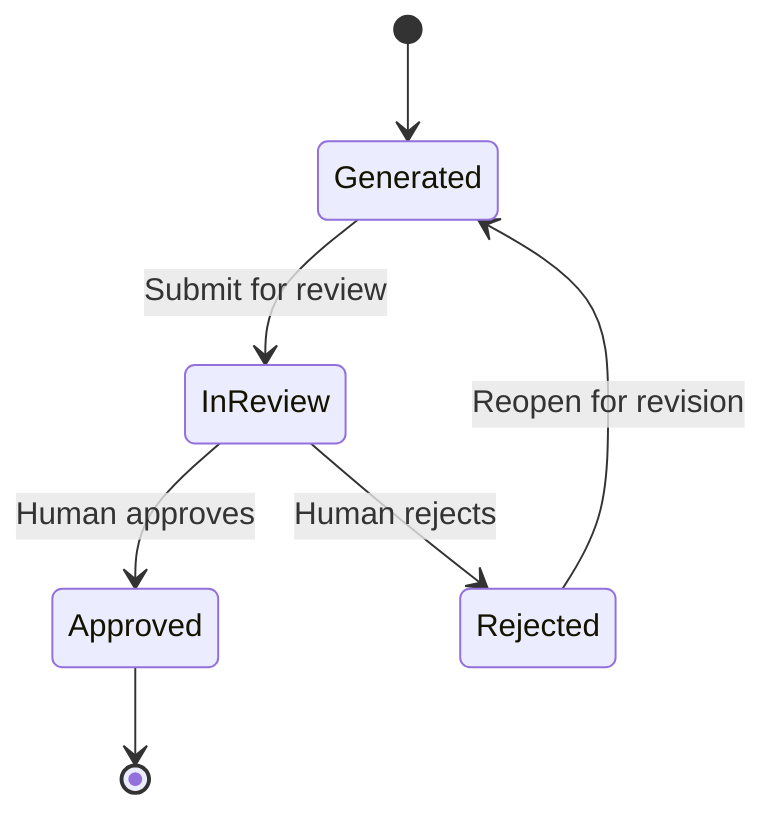

# Product Roadmap
> **Document status:** Proposed  
> **Blueprint version:** 0.2.1  
> **Roadmap type:** Directional, capability-based roadmap
## Purpose
This document describes the planned evolution of AIOS from the Minimum Viable Product (MVP) into the complete organizational operating system defined by the AIOS Blueprint.
It communicates:
- the sequence of major product capabilities;
- the outcome and boundary of each phase;
- dependencies between phases;
- guarantees later phases must preserve; and
- capabilities intentionally deferred.
This roadmap is directional rather than date-based. It does not commit AIOS to fixed delivery dates, release counts, team sizes, or commercial packaging.
The authoritative implementation scope for Phase 1 is defined in:
```text
docs/product/mvp.md
```
When this roadmap and the MVP document differ about Phase 1 scope, the MVP document is authoritative.
---
# Roadmap Philosophy
AIOS should evolve through complete, usable increments.
Each phase must:
- deliver independent user value;
- preserve guarantees established by earlier phases;
- introduce only the concepts required for its goal;
- keep human authority explicit;
- protect Organization isolation;
- preserve historical traceability;
- avoid premature distributed-system complexity; and
- validate product assumptions before adding the next layer.
The roadmap progresses through:
```text
Organizational Work
        ↓
Reliable Organizational Memory
        ↓
Structured Collaboration
        ↓
Governed AI Workforce
        ↓
Organizational Intelligence
        ↓
Extensible Platform
```
A later phase may extend an earlier model, but it must not silently redefine its historical meaning.
---
# Non-Negotiable Guarantees
## Human Authority
Human Members remain responsible for authoritative organizational actions.
AI may prepare, recommend, summarize, generate, and perform explicitly delegated technical work. AI must not independently:
- approve Decisions;
- approve Memory;
- publish Knowledge;
- grant permissions;
- change Organization ownership; or
- bypass authorization.
## Organization Isolation
Every primary business object has exactly one owning Organization.
Cross-Organization access requires an explicit sharing model. Shared access must not silently change ownership.
## Explicit State Transitions
Work, Decision, Memory, Knowledge, and Capability transitions must remain explicit and auditable.
One Aggregate must not silently change the state of another Aggregate.
## Historical Integrity
Approved Memory remains immutable.
Published Knowledge evolves through explicit revision, supersession, or retraction rather than silent overwrite.
## Traceability
The intended long-term chain is:
```text
Work
  ↓
Decision
  ↓
Memory
  ↓
Evidence
  ↓
Knowledge
  ↓
Capability
```
## Incremental Architecture
The initial implementation remains a Modular Monolith until concrete operational needs justify extraction.
Roadmap phases describe product capabilities, not mandatory deployment boundaries.
---
# Phase Summary
| Phase | Name | Primary Outcome |
|---:|---|---|
| 1 | Foundation — MVP | Human-approved organizational Memory from completed Work |
| 2 | Structured Collaboration | Repeatable workflows and stronger team coordination |
| 3 | AI Organization | Multiple governed AI Principals working with humans |
| 4 | Organizational Intelligence | Approved experience transformed into reusable Knowledge and Capability |
| 5 | Platform and Ecosystem | Stable extension model for developers, partners, and integrations |
---
# Phase 1 — Foundation (MVP)
## Goal
Provide the smallest trustworthy AIOS implementation that enables a small Organization to collaborate on Work, record Decisions, receive assistance from one Secretary, and accumulate human-approved organizational Memory.
The defining loop is:
```text
Work
  ↓
Decision
  ↓
Work Completion
  ↓
Memory Generation
  ↓
Human Review
  ↓
Approved Memory
```
Phase 1 ends at Approved Memory. Knowledge promotion is not part of the MVP.
## Core Capabilities
### Identity and Organization
- Sign in and sign out
- Basic account and Member profiles
- Create an Organization
- Invite, join, remove, or deactivate Members
- Organization-scoped authorization
- Default-deny access control
- Organization data isolation
- Auditable acting principal
### Workspace
- Personal Workspace views
- Organization Workspace views
- Assigned Work
- Pending reviews
- Notifications
- Recent organizational activity
Workspace is a presentation concept, not a separate domain or transaction boundary.
### Work
- Create and update Work
- Assign responsible Members
- Add participants
- Track status and progress
- Link Decisions
- Cancel Work when permitted
- Complete Work explicitly
Decision approval does not automatically complete Work.
### Decision
- Create Decisions
- Record context and alternatives
- Submit for review
- Approve or reject through human action
- Record reviewer and outcome
- Preserve Decision history
- Link Decisions to Work
The Secretary may assist with preparation but cannot approve or reject.
### Secretary
Phase 1 includes one Secretary per Organization.
The Secretary may:
- summarize;
- draft;
- organize;
- identify missing context;
- suggest improvements;
- prepare Decision material; and
- generate Memory drafts.
The Secretary may not:
- approve or reject;
- complete Work;
- grant permissions;
- impersonate a Member; or
- modify approved historical records.
### Memory
- Durable generation request after Work completion
- Asynchronous generation
- Idempotent retry
- One active Memory per completed Work
- Editable generated draft
- Human submission for review
- Human approval or rejection
- Reopen and revise rejected drafts
- Immutable Approved Memory
- Source traceability
- AI model and prompt metadata where available
The minimum lifecycle is:

### Audit and Reliability
- State transition history
- Human review history
- AI attribution
- Work → Decision → Memory traceability
- Transactional Outbox
- Background worker
- Retry with visible failure handling
- Idempotent handlers
## Technical Direction
Phase 1 should use:
- a Modular Monolith;
- PostgreSQL;
- explicit internal module boundaries;
- structured retrieval; and
- durable asynchronous processing.
Phase 1 does not require:
- independent microservices;
- separate databases per module;
- an external message broker;
- a vector database;
- semantic search; or
- a public API.
## Explicitly Deferred
Phase 1 excludes:
- Knowledge and Knowledge promotion;
- Evidence as an independent domain object;
- Capability;
- MemoryRevision after approval;
- AI Employees and multiple AI roles;
- autonomous multi-agent collaboration;
- custom workflow design;
- semantic retrieval and embeddings;
- external knowledge ingestion;
- public API, SDK, marketplace, and plugins;
- advanced enterprise governance; and
- cross-Organization collaboration.
## Exit Criteria
Phase 1 is complete when:
- Members can collaborate around Work;
- Members can record and review Decisions;
- one Secretary can assist without receiving human authority;
- Work completion durably triggers Memory generation;
- generation failures can be retried without duplication;
- generated Memory can be corrected before approval;
- a human can approve or reject Memory;
- Approved Memory cannot be edited;
- Work, Decisions, and Memory remain traceable;
- Organization data is isolated; and
- the product works without Knowledge or Capability.
## Product Questions
Phase 1 should answer:
- Do teams use the Secretary during real Work?
- Does the Secretary produce useful Memory drafts?
- Can human reviewers efficiently correct those drafts?
- Do Approved Memories preserve important context?
- Does explicit human approval create sufficient trust?
- Is the Work → Decision → Memory loop understandable and repeatable?
---
# Phase 2 — Structured Collaboration
## Goal
Help Organizations coordinate recurring work more consistently without introducing a fully programmable workflow platform.
Phase 2 strengthens repeatability, visibility, and coordination around the Phase 1 domain model.
## Core Capabilities
### Work Structure
- Work templates
- Repeatable Work patterns
- Dependencies
- Milestones and due dates
- Checklists
- Richer assignment rules
- Recurring Work creation
- Structured completion criteria
Templates create Work instances. They do not replace Work as the authoritative business object.
### Team Coordination
- Shared activity timeline
- Mentions and comments
- Watchers or followers
- Team-level views
- Workload visibility
- Review queues
- Escalation reminders
- Improved notification preferences
### Lightweight Workflow
- Predefined workflow patterns
- Configurable stages within supported boundaries
- Human review checkpoints
- Standard approval sequences
- Scheduled reminders
- Reusable process templates
Arbitrary executable logic and unconstrained automation remain deferred.
### Search and Memory Operations
- Improved structured search
- Filters by Organization, state, Member, and date
- Search across Work, Decision, and Approved Memory
- Saved views
- Improved Memory review queues
- Better source inspection
- Draft-versus-edited comparison
- Generation quality feedback
A formal append-only `MemoryRevision` model may be introduced if real usage demonstrates a need to correct Approved Memory.
Any correction process must preserve the original record, require human authority, record the reason, and maintain a complete revision chain.
### Operational Maturity
- Failure dashboards
- Retry administration
- Usage metrics
- Audit export
- Backup and restore procedures
- Improved observability
- Operational runbooks
## Architectural Direction
Phase 2 should remain a Modular Monolith unless measured requirements justify extraction.
Likely modules remain:
```text
Organization and Access
Work and Decision
Organizational Learning
```
Read models may support timelines, workload views, review queues, search, and reporting. They must not become the source of truth.
## Explicitly Deferred
Phase 2 still excludes:
- AI Employees;
- multi-agent orchestration;
- Knowledge promotion;
- Capability management;
- semantic organizational search;
- external knowledge ingestion;
- marketplace and SDK; and
- unrestricted workflow programming.
## Exit Criteria
Phase 2 is complete when Organizations can:
- standardize recurring work;
- coordinate multiple participants efficiently;
- identify blocked or overdue Work;
- manage review queues;
- search structured organizational history;
- reuse templates without weakening domain rules;
- observe failed asynchronous operations; and
- preserve all Phase 1 guarantees.
---
# Phase 3 — AI Organization
## Goal
Expand AIOS from one Secretary into a governed organization of specialized AI Principals working alongside human Members.
Phase 3 introduces AI Employees without treating them as human Members or granting them autonomous organizational authority.
## Actor Model
```text
Actor
   ├── HumanMember
   ├── AIPrincipal
   │      ├── Secretary
   │      └── AIEmployee
   └── SystemPrincipal
```
A Human Member holds organizational authority.
An AI Principal performs governed assistance or delegated execution.
A System Principal performs technical processing.
These categories must remain distinct in authorization, audit, assignment, responsibility, user interface, and Domain Events.
## Core Capabilities
### AI Employees
- Create specialized AI roles
- Define role purpose
- Define allowed tools and data access
- Define operating instructions
- Define Organization scope
- Assign AI Employees to Work
- Attribute output to the correct AI Principal
- Disable or retire an AI role
### Secretary Orchestration
The Secretary may recommend roles, prepare delegated tasks, route approved tasks, aggregate results, identify conflicts, and present outcomes to humans.
Orchestration must not bypass human approval.
### Governed Delegation
- Human-initiated delegation
- Explicit task boundaries
- Permission-limited tools
- Time and resource limits
- Approval checkpoints
- Cancellation
- Observable execution status
- Complete execution audit
### AI Work Execution
AI Employees may perform bounded research, drafting, classification, analysis, document preparation, data transformation, planning support, and tool-assisted technical work.
They may not independently:
- approve Decisions;
- approve Memory;
- publish Knowledge;
- change permissions;
- make irreversible external commitments; or
- claim human authorship.
### Evaluation and Governance
- Human review and feedback
- Execution success metrics
- Failure classification
- Cost visibility
- Tool-use audit
- Model and prompt versioning
- Role-level performance history
- Safe disablement
## Architectural Direction
Phase 3 may require an AI execution subsystem, tool adapters, execution queues, stronger isolation, policy evaluation, durable task state, cancellation, rate limiting, and detailed observability.
These capabilities do not automatically require microservices.
Extraction should occur only when justified by scaling, security isolation, workload characteristics, stable contracts, or operational ownership.
The business domain must remain independent of a specific AI provider.
## Explicitly Deferred
Phase 3 may still defer:
- Knowledge publication;
- Evidence lifecycle;
- Capability extraction;
- external Knowledge Sources;
- public marketplace;
- cross-Organization AI collaboration; and
- autonomous business authority.
## Exit Criteria
Phase 3 is complete when an Organization can:
- operate multiple specialized AI Principals;
- distinguish humans, AI Principals, and System Principals;
- delegate bounded tasks safely;
- inspect AI execution state and history;
- prevent AI from exercising human-only authority;
- attribute every AI result correctly;
- stop or disable unsafe execution; and
- preserve Work, Decision, and Memory integrity.
---
# Phase 4 — Organizational Intelligence
## Goal
Transform approved organizational experience into reusable, evidence-supported Knowledge and measurable organizational Capability.
Phase 4 completes the core learning model:
```text
Work
  ↓
Decision
  ↓
Memory
  ↓
Evidence
  ↓
Knowledge
  ↓
Capability
```
Approved Memory remains historical truth. Knowledge is created separately.
## Core Capabilities
### Knowledge Promotion
- Request promotion from Approved Memory
- Human review of the proposal
- Define a Knowledge claim
- Identify supporting Evidence
- Approve or reject promotion
- Publish Knowledge explicitly
- Preserve source Memory references
Knowledge promotion must never modify the source Memory.
### Evidence
Evidence provides traceable support for a Knowledge claim.
It may reference Approved Memory, Decisions, Work artifacts, internal documents, validated external sources, or structured observations.
Evidence preserves source identity, Organization ownership, provenance, relevant reference, collection time, and validation status where applicable.
### Knowledge Lifecycle
Possible states include:
- Draft;
- InReview;
- Published;
- Superseded;
- Retracted; and
- Archived.
Published Knowledge must not be silently edited.
### Knowledge Revision
- Create a revision proposal
- Preserve the prior published version
- Record rationale
- Update supporting Evidence
- Require human review
- Publish a new version
- Link superseded versions
- Retain historical accessibility
### Organizational Search
- Search Approved Memory
- Search Published Knowledge
- Filter by source, date, Work, and domain
- Trace Knowledge back to Evidence and Memory
- Explain why a result was retrieved
- Distinguish history from reusable guidance
### Semantic Retrieval
Phase 4 may introduce embeddings, vector indexes, semantic ranking, retrieval-augmented assistance, hybrid search, and relevance feedback.
Semantic indexes are projections, not the source of truth.
### Organization Brain
Organization Brain may provide a unified experience across Work, Decisions, Approved Memory, Evidence, Published Knowledge, and Capability.
Generated answers must distinguish:
- what happened;
- what was decided;
- what is supported;
- what is Published Knowledge; and
- what is AI inference.
### Replay and Capability
Replay may help examine prior Work, historical Decisions, outcomes, relevant Knowledge, alternative actions, and lessons. It does not rewrite history.
Capability represents what the Organization can repeatedly perform.
Phase 4 may support:
- identifying candidate Capability;
- linking Capability to Published Knowledge;
- defining expected outcomes;
- recording demonstrations;
- assessing maturity;
- reviewing changes; and
- tracking improvement.
Capability must not be inferred from one unreviewed AI output.
### External Knowledge Sources
External knowledge may be introduced through governed ingestion.
The system must distinguish internal Approved Memory, internal Published Knowledge, external source material, and AI-generated synthesis.
External information does not automatically become organizational Knowledge.
## Architectural Direction
Phase 4 may require Knowledge and Evidence modules, revision models, search indexing, vector storage, retrieval pipelines, provenance enforcement, evaluation pipelines, and asynchronous reindexing.
Search infrastructure must remain replaceable. Transactional domain records remain authoritative.
The Organizational Learning module becomes a candidate for extraction only when operational evidence supports it.
## Explicitly Deferred
Phase 4 may still defer:
- public developer platform;
- open marketplace;
- third-party extension publishing;
- unrestricted cross-Organization Knowledge sharing;
- autonomous Knowledge publication; and
- autonomous Capability certification.
## Exit Criteria
Phase 4 is complete when an Organization can:
- promote Approved Memory into Knowledge through human review;
- support Knowledge claims with traceable Evidence;
- publish and revise Knowledge without overwriting history;
- search and reuse organizational Knowledge;
- distinguish Memory from Knowledge;
- explain the source of retrieved guidance;
- identify or manage Capability; and
- improve future Work using accumulated intelligence.
---
# Phase 5 — Platform and Ecosystem
## Goal
Open AIOS as a stable, governed platform that can be extended by developers, partners, and customer Organizations.
Phase 5 begins only after the core domain contracts are sufficiently stable.
Extensions must not bypass domain invariants, authorization, or human authority.
## Core Capabilities
### Public API
- Versioned API
- Organization-scoped authentication
- Permission-aware access
- Work, Decision, Memory, and Knowledge operations
- Event subscriptions or webhooks
- Rate limits
- Audit attribution
- Deprecation policy
### SDK
- Supported client libraries
- Authentication helpers
- Typed domain operations
- Error handling
- Idempotency support
- Testing utilities
- Compatibility guidance
### Plugin System and Marketplace
- Declared permissions
- Installation approval
- Organization-scoped configuration
- Sandboxed execution where required
- Secret management
- Audit logs
- Disable and uninstall
- Version management
- Publisher identity
- Review process
- Permission disclosure
- Security reporting
### Integrations
- Communication tools
- Document systems
- Source-control systems
- Project-management tools
- Data platforms
- Identity providers
- External Knowledge Sources
Integrations must preserve source provenance.
### Enterprise Governance
Potential capabilities include:
- enterprise SSO;
- SCIM;
- advanced roles;
- configurable policies;
- compliance controls;
- retention configuration;
- legal hold;
- audit administration;
- data residency;
- delegated administration; and
- security review workflows.
### Cross-Organization Collaboration
A future sharing model may support shared Work, shared Knowledge, partner access, controlled publication, licensing, and revocation.
Sharing must not require one Aggregate to have multiple owners.
Ownership, access, provenance, and revocation remain distinct.
## Architectural Direction
Phase 5 may justify independently deployed integration services, public API infrastructure, event gateways, plugin execution isolation, marketplace services, tenant-specific policy evaluation, and region-aware deployment.
Service extraction remains evidence-driven.
Internal implementation details must not become permanent public contracts without deliberate design.
## Exit Criteria
Phase 5 is complete when:
- developers can integrate with stable domain operations;
- extensions declare and respect permissions;
- Organizations can install and remove extensions safely;
- every external action is attributable;
- extensions cannot bypass human-only authority;
- integrations preserve source provenance;
- public contracts are versioned; and
- ecosystem growth does not weaken earlier guarantees.
---
# Cross-Phase Dependencies
## Memory Before Knowledge
Generated, InReview, or Rejected Memory must not be treated as Published Knowledge.
Knowledge promotion begins only after Memory approval and must satisfy Knowledge review and Evidence requirements.
## Knowledge Before Capability
Capability should be supported by reusable Knowledge and observed performance.
It must not be derived solely from AI confidence or one completed Work.
## Actor Model Before Multi-Agent Operation
Human Member, AI Principal, and System Principal distinctions must be applied consistently before introducing multiple AI roles.
## Stable Domain Contracts Before Platform Exposure
Public APIs and plugins should not be introduced until internal concepts and invariants are sufficiently stable.
## Governance Before Autonomy
Any increase in AI execution scope must be preceded by:
- explicit authority boundaries;
- permission controls;
- observability;
- cancellation;
- audit; and
- human escalation.
## Provenance Before Semantic Retrieval
Semantic retrieval must not be introduced without the ability to preserve and display source provenance.
---
# Phase Gate Review
Before beginning a new phase, AIOS should review the previous phase against four gates.
## Product Gate
- Was the core user outcome achieved?
- Are teams using the capability in real workflows?
- Is the next problem supported by observed demand?
## Domain Gate
- Are the relevant terms stable?
- Are Aggregate boundaries understandable?
- Are state transitions consistent?
- Are authority rules explicit?
## Operational Gate
- Are failures visible?
- Can operations be retried safely?
- Is the system supportable?
- Are recovery procedures adequate?
## Architecture Gate
- Are module boundaries holding?
- Is extraction actually necessary?
- Are public contracts stable enough?
- Can the next capability be added without weakening historical integrity?
A phase should not advance only because its feature list is complete.
---
# Roadmap Change Policy
The roadmap may change as AIOS learns from implementation and users.
Changes should be documented when they alter:
- phase boundaries;
- product authority;
- historical meaning;
- Aggregate ownership;
- MVP scope;
- public contracts; or
- the sequence of Knowledge, Capability, and platform development.
A roadmap change must not silently redefine an already released business concept.
Material architectural changes should be recorded through an Architecture Decision Record.
---
# Complete Roadmap Outcome
The roadmap succeeds when AIOS enables an Organization to:
```text
Perform Work
    ↓
Make Decisions
    ↓
Preserve approved experience
    ↓
Build evidence-supported Knowledge
    ↓
Develop repeatable Capability
    ↓
Extend the system safely
```
The long-term objective is not feature quantity.
It is a trustworthy system through which humans and AI work together while the Organization continuously preserves, understands, and improves its own capabilities.
---
# Related Documents
- `docs/architecture/overview.md`
- `docs/product/mvp.md`
- `docs/architecture/domain-model.md`
- `docs/architecture/context-map.md`
- `docs/architecture/authorization.md`
- `docs/architecture/state-machines/work.md`
- `docs/architecture/state-machines/decision.md`
- `docs/architecture/state-machines/memory.md`
- `docs/architecture/state-machines/knowledge.md`
- `docs/architecture/adr/`
